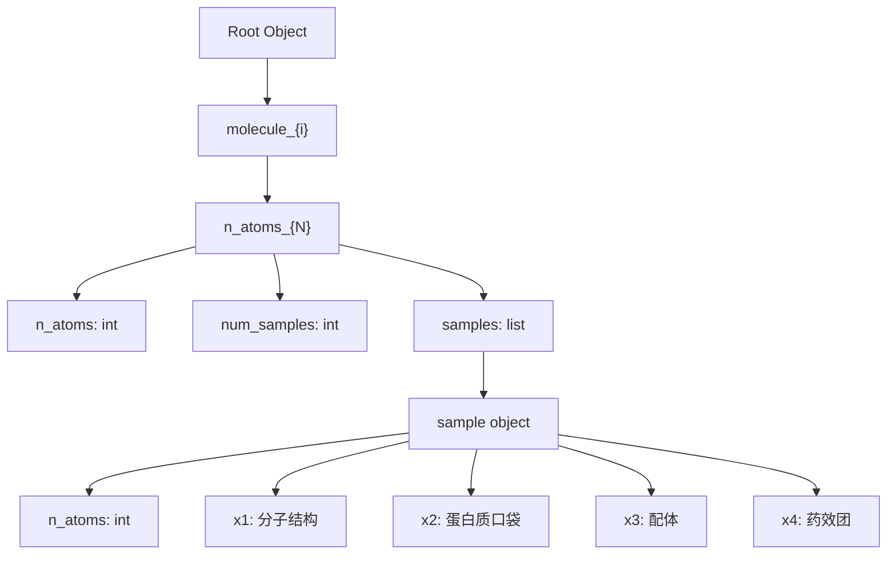

# 采样结果 JSON 格式模板说明

> 对应文件：`generated_samples_all_molecules.json`

## 整体结构概览

```
{
  "molecule_0": { ... },
  "molecule_1": { ... },
  "molecule_2": { ... },
  ...
}
```

顶层为 **分子索引**，key 格式为 `molecule_{i}`。每个 molecule 下按不同原子数分组。

---

## 层级结构



---

## 各层级详细说明

### 第一层：`molecule_{i}`

| 字段 | 类型 | 说明 |
|------|------|------|
| `molecule_{i}` | `object` | 第 `i` 个分子的所有采样数据，`i` 从 0 开始 |

### 第二层：`n_atoms_{N}`

每个 molecule 下包含 **多个原子数分组**，key 格式为 `n_atoms_{N}`。

| 字段 | 类型 | 说明 |
|------|------|------|
| `n_atoms` | `int` | 该分组中分子的原子数 `N` |
| `num_samples` | `int` | 该分组中的采样数量 |
| `samples` | `list[object]` | 采样结果列表 |

### 第三层：单个 sample 对象

| 字段 | 类型 | 说明 |
|------|------|------|
| `n_atoms` | `int` | 分子的原子数 |
| `x1` | `object` | **分子结构信息**（原子类型 + 坐标 + 化学键） |
| `x2` | `object` | **蛋白质口袋信息**（坐标） |
| `x3` | `object` | **配体信息**（电荷 + 坐标） |
| `x4` | `object` | **药效团信息**（类型 + 坐标 + 方向） |

---

## 各 `x` 字段详细格式

### `x1` — 分子结构

| 字段 | 类型 | 长度 | 说明 |
|------|------|------|------|
| `atoms` | `list[int]` | `n_atoms` | 原子序数列表（如 1=H, 6=C, 7=N, 8=O） |
| `positions` | `list[list[float]]` | `n_atoms × 3` | 原子的三维坐标 `[x, y, z]` |
| `bonds` | `list[int]` | `n_atoms*(n_atoms-1)/2` | 上三角化学键矩阵的展开（键类型编码） |

**bonds 键类型编码：**

| 值 | 含义 |
|----|------|
| 0 | 无键 |
| 1 | 单键 |
| 2 | 双键 |
| 4 | 芳香键 |

### `x2` — 蛋白质口袋（条件输入）

| 字段 | 类型 | 长度 | 说明 |
|------|------|------|------|
| `positions` | `list[list[float]]` | `M × 3` | 口袋原子的三维坐标 `[x, y, z]`，`M` 全局固定为 75 |

> [!NOTE]
> `x2.positions` 的长度在所有分子、所有分组、所有采样中恒为 **75**。这并非自然状态下蛋白质口袋的真实原子数，而是模型预处理时进行了 **padding/截断** 到统一长度，以便 batch 处理。

### `x3` — 配体（条件输入）

| 字段 | 类型 | 长度 | 说明 |
|------|------|------|------|
| `charges` | `list[float]` | `M` | 原子电荷列表，长度与 `x2.positions` 一致（全局固定 75） |
| `positions` | `list[list[float]]` | `M × 3` | 原子的三维坐标 `[x, y, z]` |

> [!NOTE]
> `x3` 与 `x2` 的长度一致（均为 75），同样经过 padding/截断处理。

### `x4` — 药效团（条件输入）

| 字段 | 类型 | 长度 | 说明 |
|------|------|------|------|
| `types` | `list[int]` | `K` | 药效团类型编码（取值 0–3），`K` 按 molecule 固定 |
| `positions` | `list[list[float]]` | `K × 3` | 药效团的三维坐标 `[x, y, z]` |
| `directions` | `list[list[float]]` | `K × 3` | 药效团的方向向量 `[dx, dy, dz]` |

> [!IMPORTANT]
> `x4` 的长度 `K` 在同一个 molecule 内保持一致，但**不同 molecule 之间不同**：
> | 分子 | `K`（x4 长度） |
> |------|------|
> | `molecule_0` | 19 |
> | `molecule_1` | 11 |
> | `molecule_2` | 22 |
>
> 这是合理的：药效团特征由蛋白质靶标决定，同一靶标下药效团数量固定。

---

## JSON 格式模板

```json
{
  "molecule_{i}": {
    "n_atoms_{N}": {
      "n_atoms": 36,
      "num_samples": 60,
      "samples": [
        {
          "n_atoms": 36,
          "x1": {
            "atoms": [6, 6, 1, ...],
            "positions": [[3.31, 4.02, 0.40], ...],
            "bonds": [0, 0, 1, ...]
          },
          "x2": {
            "positions": [[39.36, 245.41, 52.39], ...]
          },
          "x3": {
            "charges": [-0.48, -1.17, ...],
            "positions": [[4.76, -1.63, 4.03], ...]
          },
          "x4": {
            "types": [2, 1, 1, ...],
            "positions": [[3.57, 0.64, 0.49], ...],
            "directions": [[-0.71, 0.63, 0.33], ...]
          }
        }
      ]
    }
  }
}
```

---

## 实际数据统计

| 项目 | 值 |
|------|-----|
| 分子总数 | 3（`molecule_0` 至 `molecule_2`） |
| 每个分子的原子数分组数 | 25 |
| 每组的采样数 | 60 |
| `x1.atoms` 原子类型取值 | `{1, 6, 7, 8}`（H, C, N, O） |
| `x2.positions` 长度 | 75（全局固定，padding 处理） |
| `x3.charges` / `x3.positions` 长度 | 75（全局固定，padding 处理） |
| `x4` 长度 | 按 molecule 不同：19 / 11 / 22 |
