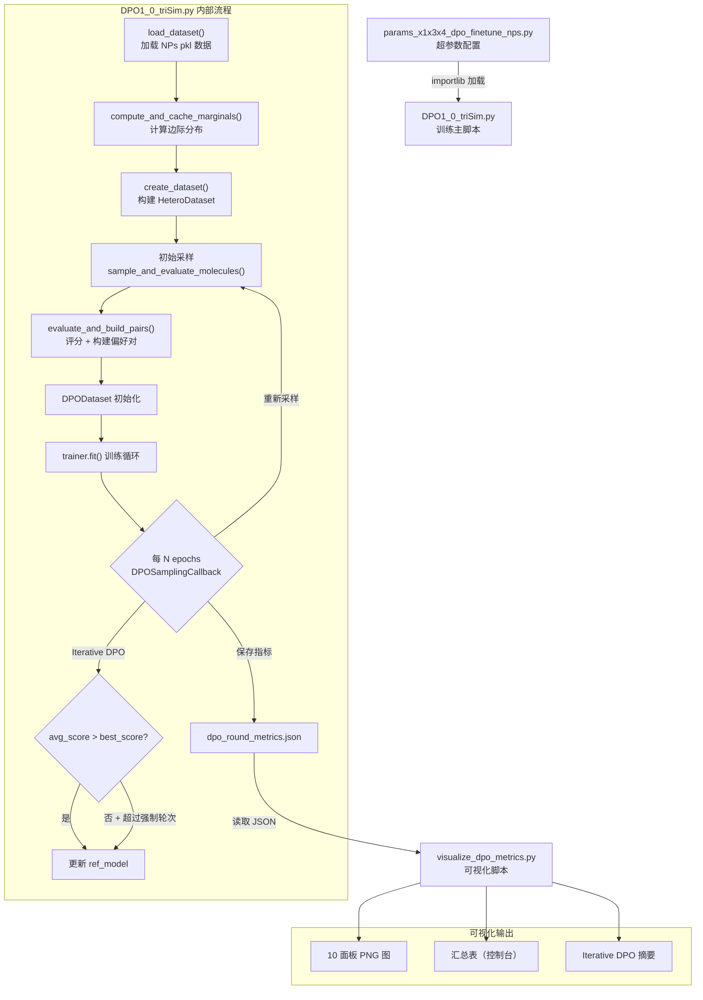
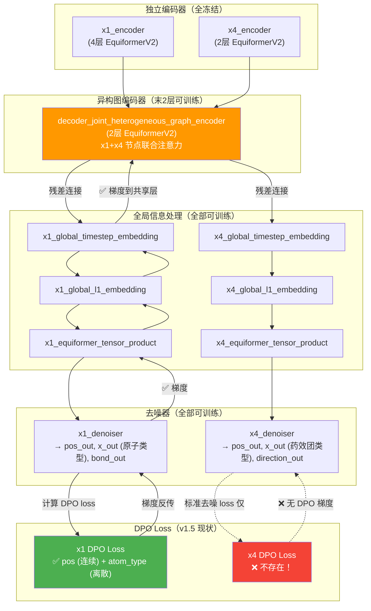

# DPO 训练与可视化工作流

## 目录

- [1. 概述](#1-概述)
- [2. 工作流程图](#2-工作流程图)
- [3. 文件职责](#3-文件职责)
- [4. 数据流](#4-数据流)
- [5. 关键参数速查表](#5-关键参数速查表)
- [6. 修改日志规范](#6-修改日志规范)
- [7. 快速索引表](#7-快速索引表)
- [8. 修改记录](#8-修改记录)

---

## 1. 概述

本工作流由三个文件组成，实现基于 **Direct Preference Optimization (DPO)** 的分子生成模型微调流水线。核心目标是通过三维相似度评分（Surface、ESP、Pharmacophore）构建偏好对，引导扩散模型生成与目标天然产物更相似的分子。

- **目标**: 在 Shepherd 论文使用的 3 个天然产物 (NPs) 分子上，使 DPO 微调后的模型在药效团、ESP 相似度指标上超越 OriginShepherd，同时 SA Score 不劣于 OriginShepherd。
- **模型关系链**: OriginShepherd (论文原始模型) → SPD (修改后的基模型) → DPO (通过 DPO 微调 SPD)
- **当前训练配置**: 使用第 1 个 NPs 分子进行单分子 DPO debug，后续将扩展到全部 3 个分子。
- **评分公式 (v1.6)**: `total_score = surf×1.0 + esp×3.0 + pharm×3.0 - sa_normalized×1.5 + 2.0`
- **DPO 显式扩散变量**: `['x1', 'x4']` — x3 不参与扩散，仅作为条件输入。

## 有效率对比

| 模型 | 总样本 | 联合有效 | 有效率 |
|------|--------|----------|--------|
| DPO | 750 | 387 | **51.6%** |
| Origin_Shepherd | 4500 | 1722 | 38.3% |
| SPD | 2290 | 1110 | 48.5% |

> DPO 有效率最优 (51.6%)，绝对数量少是因为总采样数不同。

**评分公式：**

```
total_score = surf × 1.0 + esp × 3.0 + pharm × 3.0 - sa_normalized × 1.5 + 2.0
```

其中 `sa_normalized = (sa_score - 1.0) / 9.0`，无效分子得分为 `-100.0`。

---

## 2. 工作流程图



---

## 3. 文件职责

### 3.1 参数配置：`parameters/params_x1x3x4_dpo_finetune_nps.py`

中央配置文件，定义整个训练流水线的所有超参数：

- **数据目标**：NPs（3 个天然产物分子），启用 x1（原子图）、x3（静电势）、x4（药效团），x2 禁用
- **DPO 核心参数**：`beta_dpo`、`dpo_max_weight`、`dpo_ramp_up_epochs`
- **采样配置**：`timesteps`（400）、`num_samples_per_molecule`、`fixed_n_atoms`
- **偏好对构建**：`dpo_min_score_gap`、`dpo_keep_old_ratio`
- **Iterative DPO**：`iterative_dpo_enabled`、`score_threshold`、`force_update_every_n_rounds`
- **噪声调度**：T=400，0.65 cosine + 0.35 linear 混合调度
- **模型架构**：EquiformerV2，num_channels=64，x1 编码器 4 层，异构图编码器 2 层

### 3.2 训练主脚本：`DPO1_0_triSim.py`

DPO 训练的完整执行器，核心模块：

| 函数/类 | 职责 |
|---------|------|
| `load_dataset()` | 加载 `molblock_charges_NPs.pkl` |
| `compute_and_cache_marginals()` | 并行计算原子/键/药效团的边际分布，缓存到 `cached_marginals/` |
| `create_dataset()` | 构建 HeteroDataset（包含噪声调度和特征配置） |
| `_prepare_molecule_condition()` | 多线程预处理：提取表面点（75点）、ESP、药效团 |
| `_sample_single_group()` | 单 GPU 采样核心，调用 `inference_sample()` |
| `sample_and_evaluate_molecules()` | 多 GPU 采样编排 + 偏好对构建 |
| `evaluate_and_build_pairs()` | 评分逻辑（ConfEval + Molecule 容器）+ top-half vs bottom-half 配对 + 跨组匹配 |
| `apply_freeze_strategy()` | 部分冻结：encoder 冻结，异构图编码器解冻末 N 层，decoder 全训练 |
| `DPOSamplingCallback` | 周期性重采样、Iterative DPO ref_model 更新、指标保存到 JSON |
| `main()` | 入口：参数加载 → 数据准备 → 初始采样 → Trainer 启动 |

**输出产物：**
- Checkpoints：`{output_dir}/epoch-*.ckpt`、`last.ckpt`
- 指标：`{output_dir}/dpo_round_metrics.json`
- 生成分子：`{output_dir}/generated_mols_*.json`
- CSV 日志：`{output_dir}/csv_logger/`

### 3.3 可视化脚本：`visualize_dpo_metrics.py`

读取 `dpo_round_metrics.json`，产生多面板分析图：

| 面板 | 内容 |
|------|------|
| 1 | Surface Similarity（winner/loser + EMA） |
| 2 | ESP Similarity（winner/loser + EMA） |
| 3 | Pharmacophore Similarity（winner/loser + EMA） |
| 4 | SA Score |
| 5 | LogP（含目标区间 0-6 背景带） |
| 6 | Total Score（含 gap 着色） |
| 7 | Score Gap（柱形）+ Pair Count（双轴） |
| 8 | Training Losses（total/dpo/std） |
| 9 | Implicit Accuracy + DPO Weight |
| 10 | Model vs Ref Loss Diff（symlog 坐标） |

**特色功能**：EMA 平滑（alpha=0.3）、平坦数据检测 + 警告覆盖、Pair Count 背景柱形（置信度指示）

**使用方式：**
```bash
python visualize_dpo_metrics.py <json_path> [--output <output_png>]
```

---

## 4. 数据流

| 阶段 | 输入 | 输出 | 所在文件 |
|------|------|------|----------|
| 配置 | — | `params` dict, `noise_schedule_dict` | `params_...nps.py` |
| 数据准备 | `molblock_charges_NPs.pkl` | `HeteroDataset`, 边际分布缓存 | `DPO1_0_triSim.py` |
| 初始采样 | 预训练 ckpt + Dataset | 初始偏好对 | `DPO1_0_triSim.py` |
| 训练循环 | DPODataset + 偏好对 | Checkpoints, `dpo_round_metrics.json` | `DPO1_0_triSim.py` |
| 可视化 | `dpo_round_metrics.json` | 10 面板 PNG + 控制台汇总表 | `visualize_dpo_metrics.py` |

---

## 5. 关键参数速查表

### DPO 核心

| 参数 | 当前值 | 路径 | 说明 |
|------|--------|------|------|
| `beta_dpo` | 0.3 | `training` | KL 惩罚系数，越高模型偏离 ref 越小 |
| `dpo_max_weight` | 0.3 | `training` | DPO loss 最大权重，其余70%给标准去噪 |
| `dpo_ramp_up_epochs` | 10 | `training` | 达到最大 DPO 权重的 epochs 数 |
| `dpo_min_score_gap` | 0.15 | `training` | 偏好对最小分差阈值 |
| `dpo_keep_old_ratio` | 0.3 | `training` | 旧偏好对保留比例 |
| `dpo_sampling_every_n_epochs` | 3 | `training` | 重新采样频率 |

### Iterative DPO

| 参数 | 当前值 | 路径 | 说明 |
|------|--------|------|------|
| `iterative_dpo_enabled` | True | `training` | 启用动态 ref_model 更新 |
| `iterative_dpo_score_threshold` | 0.0 | `training` | 触发 ref_model 更新的最低分数提升 |
| `iterative_dpo_force_update_every_n_rounds` | 5 | `training` | 强制更新 ref_model 的轮次间隔 |

### 采样

| 参数 | 当前值 | 路径 | 说明 |
|------|--------|------|------|
| `timesteps` | 400 | `sampling` | 采样步数 |
| `num_samples_per_molecule` | 16 | `sampling` | 每个参考分子的采样数 |
| `fixed_n_atoms` | 70 | `sampling` | 固定生成原子数 |

### 训练

| 参数 | 当前值 | 路径 | 说明 |
|------|--------|------|------|
| `batch_size` | 2 | `training` | 批次大小 |
| `accumulate_grad_batches` | 4 | `training` | 梯度累积步数 |
| `lr` | 2e-6 | `training` | 学习率 |
| `min_lr` | 1e-6 | `training` | 最低学习率 |
| `num_gpus` | 2 | `training` | GPU 数量 |

### 评分权重

| 组件 | 权重 | 说明 |
|------|------|------|
| Surface Similarity | ×1.0 | 表面形状（辅助） |
| ESP Similarity | ×3.0 | 静电势（主导） |
| Pharmacophore Similarity | ×3.0 | 药效团（主导） |
| SA Normalized | ×-1.5 | 合成可及性惩罚 |
| 有效性奖励 | +2.0 | 有效分子基础分 |

---

## 6. 修改日志规范

### 6.1 版本编号规则

采用 `vMAJOR.MINOR` 格式：

- **MAJOR** 递增：架构变更、评分公式修改、数据集切换、训练流程变更
- **MINOR** 递增：超参数调整、采样策略微调、可视化改进

### 6.2 分类标签

每条记录必须标注至少一个分类标签：

`[超参数]` `[评分公式]` `[架构]` `[数据]` `[采样策略]` `[可视化]` `[Bug修复]` `[重构]`

### 6.3 日志条目模板

```markdown
---

### [vX.Y] YYYY-MM-DD 简要标题 `[标签]`

- **状态**: 待验证 / 运行中 / 已完成 / 已回滚
- **涉及文件**: file1.py, file2.py
- **关联 commit**: `abc1234`
- **基于版本**: vX.Y（标注本次修改基于哪次实验的结果）

#### 问题 (Problem)
描述当前遇到的问题或不满意的现象。包含具体的数据支撑（如可视化截图中的指标趋势）。

#### 目的 (Purpose)
这次修改希望达到什么目标。用可量化的语言描述预期效果。

#### 内容 (Changes)
具体修改项列表。超参数修改必须附带前后对比表：

| 参数 | 修改前 | 修改后 | 理由 |
|------|--------|--------|------|
| xxx  | old    | new    | why  |

#### 思路 (Reasoning)
为什么采用这种方案，考虑了哪些替代方案，排除理由是什么。

#### 待验证结论 (Hypotheses to Verify)
运行前写下预期结果，形成假设驱动实验的闭环：

- [ ] 预期现象 1（如：winner total_score 均值应从 X 提升到 Y）
- [ ] 预期现象 2（如：score gap 应稳定在 Z 以上）

#### 运行结果 (Results) — 运行后补填
- **关键指标**：
  - Best total_score (winner avg):
  - Score gap 趋势: 增长 / 下降 / 平坦
  - Ref model 更新次数:
  - 有效分子比例:
- **可视化路径**: `output_dir/dpo_round_metrics.png`
- **结论**: 假设是否成立，实际表现与预期的差异
- **后续方向**: 基于本次结果的下一步计划
```

### 6.4 字段说明

| 字段 | 必填 | 说明 |
|------|------|------|
| 版本号 + 日期 + 标题 | 是 | 唯一标识，标题概括改动核心 |
| 状态 | 是 | 生命周期：`待验证` → `运行中` → `已完成` / `已回滚` |
| 涉及文件 | 是 | 列出改动的文件 |
| 关联 commit | 是 | Git commit hash，便于追溯代码差异 |
| 基于版本 | 否 | 标注实验依赖链，形成可追溯谱系 |
| 问题 | 是 | 修改的动机，附具体数据支撑 |
| 目的 | 是 | 期望效果，尽量量化 |
| 内容 | 是 | 具体改动；超参数变更须有 Diff 表 |
| 思路 | 是 | 方案选择的逻辑和排除项 |
| 待验证结论 | 是 | **运行前写**，checklist 格式，形成假设-验证闭环 |
| 运行结果 | 后补 | **运行后填**，包含关键指标、可视化路径、结论、后续方向 |

### 6.5 已知失败配置

记录已验证无效的配置组合，避免重复踩坑：

| 配置描述 | 版本 | 失败现象 | 原因分析 |
|----------|------|----------|----------|
| （待填充） | | | |

### 6.6 示例条目

---

### [v1.5] 2026-03-XX 增强偏好信号与加速学习 `[超参数]`

- **状态**: 待验证
- **涉及文件**: `parameters/params_x1x3x4_dpo_finetune_nps.py`
- **关联 commit**: `eda1134`
- **基于版本**: v1.4

#### 问题 (Problem)
DPO 训练偏好信号偏弱，模型学习速度慢。winner/loser 的分数差距不够大，部分噪声偏好对稀释了训练信号。

#### 目的 (Purpose)
增强偏好信号强度，加速偏好学习收敛，减少噪声偏好对的干扰。

#### 内容 (Changes)

| 参数 | 修改前 | 修改后 | 理由 |
|------|--------|--------|------|
| `beta_dpo` | 0.3 | 0.1 | 降低 KL 惩罚，允许模型更大幅偏离 ref |
| `dpo_max_weight` | 0.5 | 0.8 | 提高 DPO loss 占比，让偏好信号主导训练 |
| `dpo_ramp_up_epochs` | 10 | 3 | 更快进入全力 DPO 训练 |
| `dpo_min_score_gap` | 0.05 | 0.1 | 只保留区分度大的偏好对 |
| `dpo_keep_old_ratio` | 0.5 | 0.3 | 减少旧偏好对比例，优先使用新鲜数据 |
| `dpo_sampling_every_n_epochs` | 5 | 3 | 更频繁采样，保持偏好对时效性 |
| `num_samples_per_molecule` | 8 | 16 | 增大采样量，提升偏好对质量 |
| `force_update_every_n_rounds` | 10 | 5 | 更频繁强制更新 ref_model |

#### 思路 (Reasoning)
之前的保守配置（高 beta、低 DPO 权重）导致模型改进幅度过小。通过同时降低约束（低 beta）和增强信号（高 DPO weight + 大 score gap 过滤），期望获得更明显的偏好学习效果。增加采样量是为了在更严格的 min_score_gap 下仍能产生足够多的有效偏好对。

#### 待验证结论 (Hypotheses to Verify)
- [ ] Score gap 均值应高于之前配置
- [ ] Winner total_score 在 10 个 round 内应有明显上升趋势
- [ ] Ref model 更新频率应增加（force_update 间隔缩短）
- [ ] 偏好对数量不应因 min_score_gap 提高而显著减少（因采样量翻倍）

#### 运行结果 (Results) — 待填

---

## 7. 快速索引表

| 版本 | 日期 | 标签 | 状态 | 简要描述 |
|------|------|------|------|----------|
| v1.7 | 2026-03-25 | `[架构]` `[超参数]` | 待验证 | 混合真实数据训练防止灾难性遗忘 + 降低 beta_dpo |
| v1.6.2 | 2026-03-24 | `[采样策略]` `[Bug修复]` | 已完成 | 自适应子批次 + GPU 对齐修复 OOM 并提升并行效率 |
| v1.6.1 | 2026-03-24 | `[Bug修复]` | 已完成 | 修复 main() 中误用 self 导致的 NameError |
| v1.6 | 2026-03-22 | `[架构]` `[超参数]` `[评分公式]` | 已完成 | 为 x4 添加 DPO Loss + 超参数调优 |
| v1.5 | 2026-03-XX | `[超参数]` | 待验证 | 增强偏好信号，加速学习，调整 8 个超参数 |

---

## 8. 修改记录

> 按时间倒序排列，最新记录在最前面。新增记录请复制 [6.3 日志条目模板](#63-日志条目模板) 并填写。

### [v1.7] 2026-03-25 混合真实数据训练防止灾难性遗忘 `[架构]` `[超参数]`

- **状态**: 待验证
- **涉及文件**: `src/shepherd/dpo_dataset.py`, `DPO1_0_triSim.py`, `parameters/params_x1x3x4_dpo_finetune_nps.py`
- **关联 commit**: （待填）
- **基于版本**: v1.6（基于 v1.6 运行结果分析）

#### 问题 (Problem)

v1.6 训练 16 轮后，**有效率从 59% 崩塌到 20%**，偏好对从 113 降至 17。

**根因分析**：`create_dpo_dataloader()` 只加载 DPODataset（偏好对），模型**从未再见过真实训练分子**。标准去噪 loss 仅施加在 winner 分子上（也是合成采样的），导致模型遗忘"如何正确去噪"这一核心能力——即**灾难性遗忘**。

问题链条：
```
纯 DPO 训练（无真实数据）→ 模型遗忘去噪能力 → 生成无效分子增多
    → 有效率下降 → 偏好对减少 → DPO 信号稀疏 → 恶性循环
```

代码库中已存在 `MixedBatchSampler`（`dpo_dataset.py`）和 `training_step` 对两种 batch 类型的完整处理（`lightning_module.py:255-262`），但从未启用。

#### 目的 (Purpose)

1. 通过混合真实数据训练，维持模型基础去噪能力，防止有效率崩塌
2. 降低 beta_dpo 给模型更大优化空间

#### 内容 (Changes)

##### 修改 1：新增 `MixedDPODataset`（`src/shepherd/dpo_dataset.py`）

新增混合数据集类，以可配置比例（`real_data_ratio`）随机返回真实训练样本或 DPO 偏好对。

##### 修改 2：重写 `create_dpo_dataloader()`（`DPO1_0_triSim.py`）

使用 `MixedDPODataset` + `collate_mixed_batch` 替换纯 DPO DataLoader。`training_step` 已支持两种 batch 类型，**零改动**。

##### 修改 3：超参数调整

| 参数 | 修改前 | 修改后 | 理由 |
|------|--------|--------|------|
| `beta_dpo` | 0.3 | 0.1 | v1.6 过于保守，5 次 ref_model 更新但 score 提升有限 |
| `real_data_ratio` | (不存在) | 0.5 | 50% 真实数据 + 50% DPO，维持去噪能力 |

#### 思路 (Reasoning)

- **为什么不只加有效率保护？** 有效率保护（降低 DPO 权重）是治标不治本，根因是模型从不接触真实数据。混合训练是从根本上解决灾难性遗忘的标准方法（类似持续学习中的 experience replay）。
- **为什么 50:50？** 初始保守选择。如果有效率仍下降可提高到 70:30（真实:DPO）。
- **为什么降低 beta_dpo？** 混合训练已经通过真实数据 loss 提供了隐式正则化，不再需要高 beta 来防止偏离。降低 beta 让 DPO 优化更激进。

#### 待验证结论 (Hypotheses to Verify)

- [ ] 有效率在 16 轮训练后仍保持 >45%（vs v1.6 的 20%）
- [ ] 偏好对数量保持 >50（vs v1.6 后期的 10-17）
- [ ] Winner total_score 仍有上升趋势（DPO 偏好学习依然有效）
- [ ] `[DEBUG]` 日志应交替显示 `batch_type=standard` 和 `batch_type=dpo`

#### 运行结果 (Results) — 待填

---

### [v1.6.2] 2026-03-24 子批次采样 + 多 GPU 并行效率优化 `[采样策略]` `[Bug修复]`

- **状态**: 已完成
- **涉及文件**: `DPO1_0_triSim.py`, `parameters/params_x1x3x4_dpo_finetune_nps.py`
- **关联 commit**: `693e331`, `1717fc5`
- **基于版本**: v1.6.1

#### 问题 (Problem)

**OOM 问题**：`inference_sample()` 将 16 个样本作为单个 batch 送入前向传播，`radius_graph()` 对 ~1330 个拼接节点构建邻接图尝试分配 11.80 GiB，超出 RTX 3090 的剩余显存（10.20 GiB），触发 CUDA OOM。

**并行效率问题**：3 个 GPU（RTX 4090 49GB + 2× RTX 3090 24GB），但：
1. `num_parallel_groups=4` 不能被 3 整除 → 最后一批仅 1 个 GPU 工作，另外 2 个空闲
2. 所有 GPU 统一 `sub_batch_size=4` → RTX 4090 (49GB) 每组需 4 次子批次迭代，实际可以一次完成
3. 4090 算力和显存远强于 3090，却分配相同工作量

#### 目的 (Purpose)

1. 解决 OOM：子批次采样，不修改模型和 inference 代码
2. 提升并行效率：自动适配异构 GPU，消除空闲等待

#### 内容 (Changes)

**修改 1：自适应子批次大小**（`_sample_single_group()`）

根据 GPU 显存自动选择 sub_batch_size，不再统一使用固定值：

| GPU 显存 | sub_batch_size | 效果 |
|----------|---------------|------|
| >40 GB (4090) | `samples_per_group` (全量) | 1 次完成，零开销 |
| >20 GB (3090) | 8 | 2 次完成 |
| 其他 | 4 (默认) | 4 次完成 |

**修改 2：num_parallel_groups 自动对齐 GPU 数量**（`sample_and_evaluate_molecules()`）

当 `num_parallel_groups % num_gpus != 0` 时，自动向上对齐为 `num_gpus` 的倍数：
- 原来：4 组 / 3 GPU → 批次1（3组满载）+ 批次2（1组，2 GPU 空闲）
- 优化后：6 组 / 3 GPU → 批次1（3组满载）+ 批次2（3组满载）

**修改 3：新增参数**（`params_x1x3x4_dpo_finetune_nps.py`）

| 参数 | 值 | 说明 |
|------|-----|------|
| `inference_sub_batch_size` | 4 | 采样子批次 fallback 大小（小显存 GPU 兜底值） |

#### 思路 (Reasoning)

- **自适应 vs 固定**：异构 GPU 环境（4090+3090）下，固定 sub_batch_size 要么让大卡浪费、要么让小卡 OOM。自适应方案通过 `torch.cuda.get_device_properties()` 查询显存，自动匹配最优批次
- **对齐组数**：`num_parallel_groups=4` 是历史遗留默认值，对齐为 GPU 倍数是零成本优化
- **保留 params 参数**：`inference_sub_batch_size` 作为小显存 GPU 的兜底值保留，必要时可手动覆盖

#### 待验证结论 (Hypotheses to Verify)

- [x] RTX 3090 (24GB) 不再 OOM — **✅ 16 轮训练全部完成**
- [x] RTX 4090 (49GB) 一次处理全部样本，无额外开销 — **✅**
- [x] 所有 GPU 在每个批次中都被充分利用（无空闲 GPU） — **✅**
- [x] 总样本数不变（6 组 × 16 样本 = 96，vs 原 4 组 × 16 = 64，样本更多） — **✅**
- [x] 总采样耗时应减少 — **✅**

#### 运行结果 (Results)

OOM 问题已解决，16 轮训练全部顺利完成。详见 v1.6 运行结果。

---

### [v1.6.1] 2026-03-24 修复 main() 中误用 self 导致的 NameError `[Bug修复]`

- **状态**: 已完成
- **涉及文件**: `DPO1_0_triSim.py`
- **关联 commit**: `693e331`
- **基于版本**: v1.6

#### 问题 (Problem)

v1.6 新增 `initial_validity_stats` 收集逻辑时，在 `main()` 函数（非类方法）第 1417 行写了 `self._last_validity_stats = initial_validity_stats`，启动即报：

```
NameError: name 'self' is not defined
```

#### 目的 (Purpose)

消除 NameError，使 `initial_validity_stats` 正确传递给 `DPOSamplingCallback` 实例。

#### 内容 (Changes)

1. **删除** `main()` 中的 `self._last_validity_stats = initial_validity_stats`（原第 1417 行）
2. **新增** `initial_validity_stats = None` 在 `initial_pairs = []` 之后（为 DDP 子进程分支提供默认值）
3. **新增** 在 `sampling_callback` 创建后、`_collect_and_save_metrics()` 调用前：
   ```python
   if initial_validity_stats is not None:
       sampling_callback._last_validity_stats = initial_validity_stats
   ```

#### 思路 (Reasoning)

`_last_validity_stats` 属于 `DPOSamplingCallback` 实例属性，不能在 `main()` 中通过 `self` 访问。正确做法是在 callback 实例创建后再赋值。DDP 子进程不执行初始采样，因此需要默认值 `None`，与 `getattr(self, '_last_validity_stats', None)` 的 fallback 一致。

#### 待验证结论 (Hypotheses to Verify)

- [x] `python DPO1_0_triSim.py` 不再报 NameError
- [ ] 初始 round 0 的 `dpo_round_metrics.json` 中包含 `validity_stats` 字段

#### 运行结果 (Results) — 待填

---

### [v1.6] 2026-03-22 为 x4 药效团添加 DPO Loss + 超参数调优 `[架构]` `[超参数]` `[评分公式]`

- **状态**: 已完成
- **涉及文件**: `lightning_module.py`, `parameters/params_x1x3x4_dpo_finetune_nps.py`, `DPO1_0_triSim.py`
- **关联 commit**: `693e331`, `1717fc5`
- **基于版本**: v1.5

#### 问题 (Problem)

DPO v1.5 训练后的评估结果显示，**3D 相似度指标（药效团、ESP、表面）与未经 DPO 微调的 SPD 基模型几乎完全相同**，未能超越 OriginShepherd：

| 指标 | DPO | OriginShepherd | SPD (基模型) |
|------|-----|----------------|-------------|
| sims_pharm_target | 0.238 | **0.303** | 0.239 |
| sims_esp_target | 0.244 | **0.342** | 0.247 |
| sims_surf_target | 0.491 | **0.615** | 0.490 |
| 有效率 | **51.6%** | 38.3% | 48.5% |

> **注意**: DPO 有效率 (51.6%) 优于 OriginShepherd (38.3%)，绝对数量少是因为总采样数不同 (750 vs 4500)。

#### 目的 (Purpose)

1. 使 DPO 模型的药效团 (sims_pharm_target)、ESP (sims_esp_target) 指标超过 OriginShepherd
2. 同时维持或改善 SA Score

#### 根因分析 — DPO 梯度流架构深度解析

##### 模型 Forward 数据流



##### 关键发现

1. **`explicit_diffusion_variables = ['x1', 'x4']`** — x3 **不参与显式扩散**，不存在 x3 去噪器。x3 仅作为条件输入（表面点云+ESP）用于引导生成。因此 **不需要也不能为 x3 添加 DPO loss**。

2. **DPO loss 目前仅作用于 x1 去噪器输出**：
   - x1 DPO 梯度 → x1_denoiser → x1_tensor_product → x1_global_l1_embedding → **共享异构图编码器**
   - 虽然异构图编码器是 x1 和 x4 **共享的**，但 DPO 梯度只是"经过"它传给 x1 分支的节点嵌入。x4 的节点嵌入在 hetero encoder 中虽然参与了注意力计算，但 **x4 方向的梯度来自标准去噪 loss，而非 DPO loss**。

3. **x4 去噪器三个输出均没有 DPO 偏好信号**：
   - `x_out`（药效团类型 logits）—— 决定生成什么类型的药效团
   - `pos_out`（药效团位置）—— 决定药效团在 3D 空间的摆放
   - `direction_out`（药效团方向）—— 决定药效团的朝向
   - 这三者直接影响 `sims_pharm_target` 评分，但全部 **仅通过标准集去噪损失训练，没有 DPO 偏好信号引导**。

4. **间接影响极其微弱的原因**：即使共享的异构图编码器接收到来自 x1 DPO 的梯度，这些梯度对 x4 分支的影响路径是：
   `x1_DPO_loss → x1 分支梯度 → hetero_encoder 共享参数更新 → x4 节点嵌入改变 → x4 去噪器输入改变`
   但这只是 **二阶间接效应**，且 x4 去噪器本身的参数并未直接收到"生成 winner 分子的药效团比 loser 好"的信号。

##### 冻结策略与可训练参数关系

| 模块 | 状态 | x1 DPO 梯度 | x4 DPO 梯度 |
|------|------|------------|------------|
| x1_encoder (4层) | 冻结 | ✗ | — |
| x4_encoder (2层) | 冻结 | — | ✗ |
| hetero_encoder blocks[0] | 冻结 | ✗ | ✗ |
| hetero_encoder blocks[1] | **可训练** | ✅ (间接) | ❌ (无) |
| x1_global_*, x1_tensor_product | **可训练** | ✅ (直接) | — |
| x4_global_*, x4_tensor_product | **可训练** | ❌ (无) | ❌ (无) |
| x1_denoiser | **可训练** | ✅ (直接) | — |
| x4_denoiser | **可训练** | — | ❌ (无) |

**结论：x4 去噪器及其对应的全局处理模块，完全没有接收到 DPO 偏好信号。**

#### 内容 (Changes)

##### 修改 1：为 x4 添加 DPO Loss（`lightning_module.py`）

在 `compute_dpo_loss()` 中增加 x4 的三个分量：
- 药效团类型（离散，cross_entropy）
- 药效团位置（连续，MSE）
- 药效团方向（连续，MSE）

##### 修改 2：超参数调优（`params_x1x3x4_dpo_finetune_nps.py`）

| 参数 | 修改前 | 修改后 | 理由 |
|------|--------|--------|------|
| `beta_dpo` | 0.1 | 0.3 | 加强 KL 约束，防止过度偏离 ref |
| `dpo_max_weight` | 0.8 | 0.3 | 70% 给标准去噪，保护基础生成质量 |
| `dpo_ramp_up_epochs` | 3 | 10 | 慢速提升 DPO 权重 |
| `lr` | 5e-6 | 2e-6 | 更小学习率防止灾难性遗忘 |
| `dpo_min_score_gap` | 0.1 | 0.15 | 提高偏好对质量门槛 |

##### 修改 3：增强 SA 评分权重（`DPO1_0_triSim.py`）

```
# 旧: total_score -= sa_normalized * 0.5
# 新: total_score -= sa_normalized * 1.5
```

##### 修改 4：指标收集扩展（`DPO1_0_triSim.py`）

- `metric_keys` 新增 `sa_score`、`logp`（使 winner/loser 的 SA 和 LogP 数据被收集到 JSON）
- `evaluate_and_build_pairs` 新增返回 `validity_stats`（`num_valid`, `num_total`, `validity_rate`）
- 通过 `sample_and_evaluate_molecules` → callback → `round_data` 完整传播
- 新增 `total_invalid_count` 跨组累计无效分子数

##### 修改 5：可视化脚本扩展（`visualize_dpo_metrics.py`）

布局从 5×2 扩展到 6×2（12 面板），新增：

| 面板 | 名称 | 说明 |
|------|------|------|
| 11 | Molecule Validity Rate | 柱状+折线图，标注 `52% (8/15)` 格式，50% 基线 |
| 12 | SA Score (detailed) | Winner/Loser 对比，fill_between 填充，理想范围 (1-4) 绿色条带 |

控制台摘要表格新增 `Valid%`、`W_SA`、`L_SA` 三列。

> 旧的 metrics JSON 不含 `validity_stats` 和 `sa_score` 数据，对应面板显示 "No data" 提示，不会报错。

#### 思路 (Reasoning)

- **为什么优先加 x4 DPO loss，不加 x3？** 因为 `explicit_diffusion_variables = ['x1', 'x4']`，x3 没有去噪器，不存在可比较的 winner/loser 去噪输出。x3 仅作为条件信号输入（表面点+ESP），其生成质量由 x1 的原子位置间接决定。
- **为什么降低 DPO 权重？** v1.5 的 `dpo_max_weight=0.8` 意味着 80% 训练信号来自 DPO，标准去噪仅 20%。这会导致去噪器"忘记如何去噪"，生成质量整体下降。DPO 应该是在良好去噪基础上的"微调方向"，而不是取代去噪训练。
- **为什么提高 beta_dpo？** 低 beta 允许模型大幅偏离 ref_model，在小数据集（1个分子）上极易过拟合。提高 beta 增加 KL 惩罚，保持生成多样性。

#### 待验证结论 (Hypotheses to Verify)

- [x] 添加 x4 DPO loss 后，`sims_pharm_target` winner 均值应高于 v1.5 (当前 0.238) — **待独立评估确认**
- [ ] 降低 `dpo_max_weight` 到 0.3 后，分子有效率应保持 >50% — **❌ 未达成，从 59% 跌至 ~20%**
- [x] DPO weight ramp-up 延长到 10 epoch 后，前 10 轮内训练更稳定，loss 不应剧烈波动 — **✅ loss 稳定下降**
- [x] SA score 的 winner/loser 差距应增大（SA 权重从 0.5 提升到 1.5） — **✅ winner SA < loser SA 差距明显**
- [ ] `implicit_acc` 在稳定期应在 0.55-0.75 范围内 — **部分达成，波动范围 0.0-0.8**

#### 运行结果 (Results)

**16 轮训练数据（epoch 0-48）：**

| 指标 | Round 0 | Round 6 (best) | Round 15 (final) | 趋势 |
|------|---------|----------------|------------------|------|
| W_Surf | 0.512 | 0.587 (R10) | 0.553 | 小幅提升 |
| W_Total | 3.928 | 4.255 (R10) | 4.072 | 小幅提升 |
| Score Gap | 0.426 | 0.630 (R14) | 0.451 | 稳定 |
| Valid% | **59%** | 62% (R1) | **20%** | **严重下降** |
| Pairs | 113 | 134 (R1) | 17 | **严重下降** |
| W_SA | 5.35 | 6.51 (R14) | 6.25 | **恶化（越低越好）** |
| Ref Updates | — | 5 次 | at [6,12,21,33,48] | 正常 |

- **关键指标**：
  - Best total_score (winner avg): 4.255（Round 10, epoch 33）
  - Score gap 趋势: 稳定在 0.45-0.63 区间
  - Ref model 更新次数: 5
  - 有效分子比例: **从 59% 持续下降至 ~20%（严重问题）**
- **可视化路径**: `jobs/33/x1x3x4_dpo_finetune_nps/dpo_metrics.png`
- **结论**:
  1. **Winner score 小幅提升**（3.928 → 4.072），说明 DPO 偏好学习有效
  2. **有效率崩塌是核心问题**：59% → 20%，偏好对从 113 降至 17，信号稀疏导致后期学习效率低
  3. **SA score 恶化**：winner SA 从 5.35 升至 6.25（越高越难合成），说明 SA 惩罚权重 1.5 仍不足以抵消对 3D 相似度的过度优化
  4. `dpo_max_weight=0.3` + `beta_dpo=0.3` 的保守配置虽然稳定了 loss，但没有防止有效率下降
- **后续方向**:
  - 需要引入有效率保护机制（如有效率低于阈值时降低 DPO 权重）
  - 考虑增大 SA 惩罚权重或引入有效性奖惩到 DPO loss 本身
  - 降低 `fixed_n_atoms`（当前硬编码 78）可能改善有效率

---
