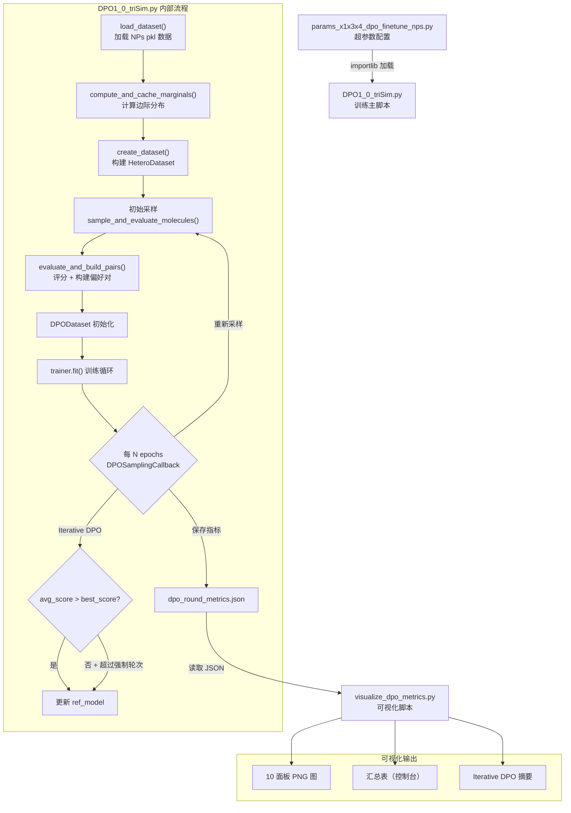
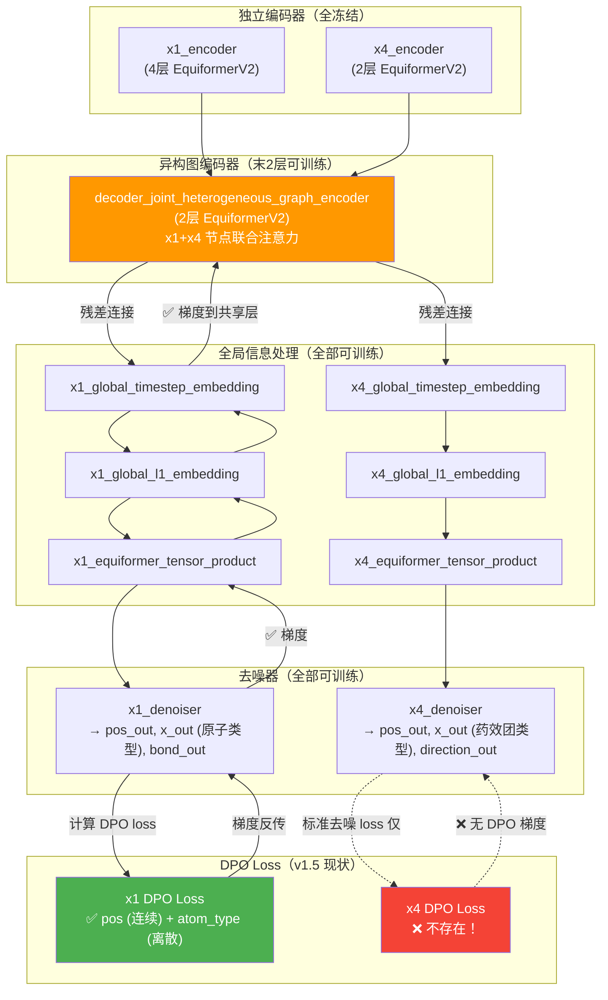

# DPO 训练与可视化工作流

## 目录

- [1. 概述](#1-概述)
- [2. 工作流程图](#2-工作流程图)
- [3. 文件职责](#3-文件职责)
- [4. 数据流](#4-数据流)
- [5. 关键参数速查表](#5-关键参数速查表)
- [6. 修改日志规范](#6-修改日志规范)
- [7. 迭代决策框架](#7-迭代决策框架)
- [8. 版本指标对比](#8-版本指标对比)
- [9. 快速索引表](#9-快速索引表)
- [10. 修改记录](#10-修改记录)
- [问题修复日志](../.Project/bugfix_log.md) ← 运行时报错详细记录与修复方法

---

## 1. 概述

本工作流由三个文件组成，实现基于 **Direct Preference Optimization (DPO)** 的分子生成模型微调流水线。核心目标是通过三维相似度评分（Surface、ESP、Pharmacophore）构建偏好对，引导扩散模型生成与目标天然产物更相似的分子。

- **目标**: 在 Shepherd 论文使用的 3 个天然产物 (NPs) 分子上，使 DPO 微调后的模型在药效团、ESP 相似度指标上超越 OriginShepherd，同时 SA Score 不劣于 OriginShepherd。
- **模型关系链**: OriginShepherd (论文原始模型) → SPD (修改后的基模型) → DPO (通过 DPO 微调 SPD)
- **当前训练配置**: 使用第 1 个 NPs 分子进行单分子 DPO debug，后续将扩展到全部 3 个分子。
- **评分公式 (v1.6)**: `total_score = surf×1.0 + esp×3.0 + pharm×3.0 - sa_normalized×1.5 + 2.0`
- **DPO 显式扩散变量**: `['x1', 'x4']` — x3 不参与扩散，仅作为条件输入。

## 有效率对比

| 模型 | 总样本 | 联合有效 | 有效率 |
|------|--------|----------|--------|
| DPO | 750 | 387 | **51.6%** |
| Origin_Shepherd | 4500 | 1722 | 38.3% |
| SPD | 2290 | 1110 | 48.5% |

> DPO 有效率最优 (51.6%)，绝对数量少是因为总采样数不同。

**评分公式：**

```
total_score = surf × 1.0 + esp × 3.0 + pharm × 3.0 - sa_normalized × 1.5 + 2.0
```

其中 `sa_normalized = (sa_score - 1.0) / 9.0`，无效分子得分为 `-100.0`。

---

## 2. 工作流程图



---

## 3. 文件职责

### 3.1 参数配置：`parameters/params_x1x3x4_dpo_finetune_nps.py`

中央配置文件，定义整个训练流水线的所有超参数：

- **数据目标**：NPs（3 个天然产物分子），启用 x1（原子图）、x3（静电势）、x4（药效团），x2 禁用
- **DPO 核心参数**：`beta_dpo`、`dpo_max_weight`、`dpo_ramp_up_epochs`
- **采样配置**：`timesteps`（400）、`num_samples_per_molecule`、`fixed_n_atoms`
- **偏好对构建**：`dpo_min_score_gap`、`dpo_keep_old_ratio`
- **Iterative DPO**：`iterative_dpo_enabled`、`score_threshold`、`force_update_every_n_rounds`
- **噪声调度**：T=400，0.65 cosine + 0.35 linear 混合调度
- **模型架构**：EquiformerV2，num_channels=64，x1 编码器 4 层，异构图编码器 2 层

### 3.2 训练主脚本：`DPO1_0_triSim.py`

DPO 训练的完整执行器，核心模块：

| 函数/类 | 职责 |
|---------|------|
| `load_dataset()` | 加载 `molblock_charges_NPs.pkl` |
| `compute_and_cache_marginals()` | 并行计算原子/键/药效团的边际分布，缓存到 `cached_marginals/` |
| `create_dataset()` | 构建 HeteroDataset（包含噪声调度和特征配置） |
| `_prepare_molecule_condition()` | 多线程预处理：提取表面点（75点）、ESP、药效团 |
| `_sample_single_group()` | 单 GPU 采样核心，调用 `inference_sample()` |
| `sample_and_evaluate_molecules()` | 多 GPU 采样编排 + 偏好对构建 |
| `evaluate_and_build_pairs()` | 评分逻辑（ConfEval + Molecule 容器）+ top-half vs bottom-half 配对 + 跨组匹配 |
| `apply_freeze_strategy()` | 部分冻结：encoder 冻结，异构图编码器解冻末 N 层，decoder 全训练 |
| `DPOSamplingCallback` | 周期性重采样、Iterative DPO ref_model 更新、指标保存到 JSON |
| `main()` | 入口：参数加载 → 数据准备 → 初始采样 → Trainer 启动 |

**输出产物：**
- Checkpoints：`{output_dir}/epoch-*.ckpt`、`last.ckpt`
- 指标：`{output_dir}/dpo_round_metrics.json`
- 生成分子：`{output_dir}/generated_mols_*.json`
- CSV 日志：`{output_dir}/csv_logger/`

### 3.3 可视化脚本：`visualize_dpo_metrics.py`

读取 `dpo_round_metrics.json`，产生多面板分析图：

| 面板 | 内容 |
|------|------|
| 1 | Surface Similarity（winner/loser + EMA） |
| 2 | ESP Similarity（winner/loser + EMA） |
| 3 | Pharmacophore Similarity（winner/loser + EMA） |
| 4 | SA Score |
| 5 | LogP（含目标区间 0-6 背景带） |
| 6 | Total Score（含 gap 着色） |
| 7 | Score Gap（柱形）+ Pair Count（双轴） |
| 8 | Training Losses（total/dpo/std） |
| 9 | Implicit Accuracy + DPO Weight |
| 10 | Model vs Ref Loss Diff（symlog 坐标） |

**特色功能**：EMA 平滑（alpha=0.3）、平坦数据检测 + 警告覆盖、Pair Count 背景柱形（置信度指示）

**使用方式：**
```bash
python visualize_dpo_metrics.py <json_path> [--output <output_png>]
```

---

## 4. 数据流

| 阶段 | 输入 | 输出 | 所在文件 |
|------|------|------|----------|
| 配置 | — | `params` dict, `noise_schedule_dict` | `params_...nps.py` |
| 数据准备 | `molblock_charges_NPs.pkl` | `HeteroDataset`, 边际分布缓存 | `DPO1_0_triSim.py` |
| 初始采样 | 预训练 ckpt + Dataset | 初始偏好对 | `DPO1_0_triSim.py` |
| 训练循环 | DPODataset + 偏好对 | Checkpoints, `dpo_round_metrics.json` | `DPO1_0_triSim.py` |
| 可视化 | `dpo_round_metrics.json` | 10 面板 PNG + 控制台汇总表 | `visualize_dpo_metrics.py` |

---

## 5. 关键参数速查表

### DPO 核心

| 参数 | 当前值 | 路径 | 说明 |
|------|--------|------|------|
| `beta_dpo` | 0.3 | `training` | KL 惩罚系数，越高模型偏离 ref 越小 |
| `dpo_max_weight` | 0.3 | `training` | DPO loss 最大权重，其余70%给标准去噪 |
| `dpo_ramp_up_epochs` | 10 | `training` | 达到最大 DPO 权重的 epochs 数 |
| `dpo_min_score_gap` | 0.15 | `training` | 偏好对最小分差阈值 |
| `dpo_keep_old_ratio` | 0.3 | `training` | 旧偏好对保留比例 |
| `dpo_sampling_every_n_epochs` | 3 | `training` | 重新采样频率 |

### Iterative DPO

| 参数 | 当前值 | 路径 | 说明 |
|------|--------|------|------|
| `iterative_dpo_enabled` | False | `training` | 禁用动态 ref_model 更新（v1.8），参考模型固定为预训练权重 |
| `iterative_dpo_score_threshold` | 0.0 | `training` | 触发 ref_model 更新的最低分数提升 |
| `iterative_dpo_force_update_every_n_rounds` | 5 | `training` | 强制更新 ref_model 的轮次间隔 |

### 采样

| 参数 | 当前值 | 路径 | 说明 |
|------|--------|------|------|
| `timesteps` | 400 | `sampling` | 采样步数 |
| `num_samples_per_molecule` | 16 | `sampling` | 每个参考分子的采样数 |
| `fixed_n_atoms` | 70 | `sampling` | 固定生成原子数 |

### 训练

| 参数 | 当前值 | 路径 | 说明 |
|------|--------|------|------|
| `batch_size` | 2 | `training` | 批次大小 |
| `accumulate_grad_batches` | 4 | `training` | 梯度累积步数 |
| `lr` | 2e-6 | `training` | 学习率 |
| `min_lr` | 1e-6 | `training` | 最低学习率 |
| `num_gpus` | 2 | `training` | GPU 数量 |

### 评分权重

| 组件 | 权重 | 说明 |
|------|------|------|
| Surface Similarity | ×1.0 | 表面形状（辅助） |
| ESP Similarity | ×3.0 | 静电势（主导） |
| Pharmacophore Similarity | ×3.0 | 药效团（主导） |
| SA Normalized | ×-1.5 | 合成可及性惩罚 |
| 有效性奖励 | +2.0 | 有效分子基础分 |

---

## 6. 修改日志规范

### 6.1 版本编号规则

采用 `vMAJOR.MINOR` 格式：

- **MAJOR** 递增：架构变更、评分公式修改、数据集切换、训练流程变更
- **MINOR** 递增：超参数调整、采样策略微调、可视化改进

### 6.2 分类标签

每条记录必须标注至少一个分类标签：

`[超参数]` `[评分公式]` `[架构]` `[数据]` `[采样策略]` `[可视化]` `[Bug修复]` `[重构]`

### 6.3 日志条目模板

```markdown
---

### [vX.Y] YYYY-MM-DD 简要标题 `[标签]`

- **状态**: 待验证 / 运行中 / 已完成 / 已回滚
- **涉及文件**: file1.py, file2.py
- **关联 commit**: `abc1234`
- **基于版本**: vX.Y（标注本次修改基于哪次实验的结果）

#### 问题 (Problem)
描述当前遇到的问题或不满意的现象。包含具体的数据支撑（如可视化截图中的指标趋势）。

#### 目的 (Purpose)
这次修改希望达到什么目标。用可量化的语言描述预期效果。

#### 内容 (Changes)
具体修改项列表。超参数修改必须附带前后对比表：

| 参数 | 修改前 | 修改后 | 理由 |
|------|--------|--------|------|
| xxx  | old    | new    | why  |

#### 思路 (Reasoning)
为什么采用这种方案，考虑了哪些替代方案，排除理由是什么。

#### 待验证结论 (Hypotheses to Verify)
运行前写下预期结果，形成假设驱动实验的闭环：

- [ ] 预期现象 1（如：winner total_score 均值应从 X 提升到 Y）
- [ ] 预期现象 2（如：score gap 应稳定在 Z 以上）

#### 运行结果 (Results) — 运行后补填
- **关键指标**：
  - Best total_score (winner avg):
  - Score gap 趋势: 增长 / 下降 / 平坦
  - Ref model 更新次数:
  - 有效分子比例:
- **可视化路径**: `output_dir/dpo_round_metrics.png`
- **结论**: 假设是否成立，实际表现与预期的差异
- **后续方向**: 基于本次结果的下一步计划
```

### 6.4 字段说明

| 字段 | 必填 | 说明 |
|------|------|------|
| 版本号 + 日期 + 标题 | 是 | 唯一标识，标题概括改动核心 |
| 状态 | 是 | 生命周期：`待验证` → `运行中` → `已完成` / `已回滚` |
| 涉及文件 | 是 | 列出改动的文件 |
| 关联 commit | 是 | Git commit hash，便于追溯代码差异 |
| 基于版本 | 否 | 标注实验依赖链，形成可追溯谱系 |
| 问题 | 是 | 修改的动机，附具体数据支撑 |
| 目的 | 是 | 期望效果，尽量量化 |
| 内容 | 是 | 具体改动；超参数变更须有 Diff 表 |
| 思路 | 是 | 方案选择的逻辑和排除项 |
| 待验证结论 | 是 | **运行前写**，checklist 格式，形成假设-验证闭环 |
| 运行结果 | 后补 | **运行后填**，包含关键指标、可视化路径、结论、后续方向 |

### 6.5 已知失败配置

记录已验证无效的配置组合，避免重复踩坑：

| 配置描述 | 版本 | 失败现象 | 原因分析 |
|----------|------|----------|----------|
| 配置描述 | 版本 | 失败现象 | 原因分析 |
|----------|------|----------|----------|
| 纯 DPO 训练（无真实数据），`dpo_max_weight=0.8` | v1.5 | 3D 相似度与基模型无差异 | DPO 权重过高侵蚀去噪能力，无真实数据维持基础能力 |
| 纯 DPO 训练，`dpo_max_weight=0.3`, `beta=0.3` | v1.6 | Valid% 59%→20%，SA 恶化 | 保守配置仍崩塌，根因：无真实数据混合 |
| 混合训练（1 分子 50%），`beta=0.1` | v1.7 | Valid% 61%→12%，比 v1.6 更差 | 1 个分子的正则化完全不足；beta=0.1 过低导致偏离更快；18 轮 0 次 ref 更新 |
| v1.8 配置 + 离散推理修复，`iterative_dpo=False` | v1.9 | R0 基线 Valid% 仅 50%（v1.6 为 59%），20 轮后跌至 11% | 推理代码修复导致训练-推理一致性变化，SPD 基模型可能需要在修复后的代码上重训 |

### 6.6 示例条目

---

### [v1.5] 2026-03-XX 增强偏好信号与加速学习 `[超参数]`

- **状态**: 待验证
- **涉及文件**: `parameters/params_x1x3x4_dpo_finetune_nps.py`
- **关联 commit**: `eda1134`
- **基于版本**: v1.4

#### 问题 (Problem)
DPO 训练偏好信号偏弱，模型学习速度慢。winner/loser 的分数差距不够大，部分噪声偏好对稀释了训练信号。

#### 目的 (Purpose)
增强偏好信号强度，加速偏好学习收敛，减少噪声偏好对的干扰。

#### 内容 (Changes)

| 参数 | 修改前 | 修改后 | 理由 |
|------|--------|--------|------|
| `beta_dpo` | 0.3 | 0.1 | 降低 KL 惩罚，允许模型更大幅偏离 ref |
| `dpo_max_weight` | 0.5 | 0.8 | 提高 DPO loss 占比，让偏好信号主导训练 |
| `dpo_ramp_up_epochs` | 10 | 3 | 更快进入全力 DPO 训练 |
| `dpo_min_score_gap` | 0.05 | 0.1 | 只保留区分度大的偏好对 |
| `dpo_keep_old_ratio` | 0.5 | 0.3 | 减少旧偏好对比例，优先使用新鲜数据 |
| `dpo_sampling_every_n_epochs` | 5 | 3 | 更频繁采样，保持偏好对时效性 |
| `num_samples_per_molecule` | 8 | 16 | 增大采样量，提升偏好对质量 |
| `force_update_every_n_rounds` | 10 | 5 | 更频繁强制更新 ref_model |

#### 思路 (Reasoning)
之前的保守配置（高 beta、低 DPO 权重）导致模型改进幅度过小。通过同时降低约束（低 beta）和增强信号（高 DPO weight + 大 score gap 过滤），期望获得更明显的偏好学习效果。增加采样量是为了在更严格的 min_score_gap 下仍能产生足够多的有效偏好对。

#### 待验证结论 (Hypotheses to Verify)
- [ ] Score gap 均值应高于之前配置
- [ ] Winner total_score 在 10 个 round 内应有明显上升趋势
- [ ] Ref model 更新频率应增加（force_update 间隔缩短）
- [ ] 偏好对数量不应因 min_score_gap 提高而显著减少（因采样量翻倍）

#### 运行结果 (Results) — 待填

---

## 7. 迭代决策框架

训练过程中，根据以下三类条件判断何时停止当前实验、进行正式评估、或切换策略。

### 7.1 保护性停止（异常，立即停止训练）

| 条件 | 阈值 | 依据 | 动作 |
|------|------|------|------|
| Valid% 连续 3 轮下降且低于阈值 | < **40%** | v1.6 在 Round 4 跌破 47% 后未恢复 | 停止，分析原因，调整策略 |
| Pairs 数量过低 | < **30** | 偏好对太少，统计噪声主导 Acc | 停止，考虑增大采样量或降低 min_score_gap |
| Loss 发散 | 连续 2 轮 NaN 或 > 20 | 训练崩溃 | 停止，检查学习率和梯度 |

### 7.2 目标性停止（达标，进行正式评估）

DPO 训练中 `W_Surf`、`W_Total` 是采样时的粗略指标，达到以下条件后应停止训练、用 `evaluation/` 脚本跑 750+ 样本的正式评估：

| 条件 | 阈值 | 说明 |
|------|------|------|
| W_Total 持续 3 轮稳定高于历史最佳 | > **4.3** | 证明 DPO 偏好学习有效且稳定 |
| Valid% 保持健康 | > **45%** | 基础生成能力未退化 |
| 两者同时满足 | — | 停下来跑正式评估，与 OriginShepherd 对比 |

**OriginShepherd 基准（正式评估目标）：**

| 指标 | OriginShepherd | SPD 基模型 | 目标 |
|------|---------------|------------|------|
| sims_pharm_target | 0.303 | 0.239 | > 0.303 |
| sims_esp_target | 0.342 | 0.247 | > 0.342 |
| sims_surf_target | 0.615 | 0.490 | > 0.580 |
| Valid% | 38.3% | 48.5% | > 45% |

### 7.3 停滞性停止（无效，切换策略）

| 条件 | 阈值 | 含义 | 动作 |
|------|------|------|------|
| W_Total 无提升 | 连续 **5 轮**（15 epoch）未超过历史最佳 | DPO 已收敛或陷入局部最优 | 停止，反思策略（换公式/解冻更多层/调数据比例） |
| Score Gap 塌缩 | 连续 3 轮 < **0.3** | Winner/Loser 无区分度，DPO 信号消失 | 停止，增大采样量或降低 min_score_gap |
| Ref model 长期未更新 | > **8 轮** 未更新（仅 Iterative DPO 启用时） | 模型分数始终未超越 ref | 考虑强制更新或禁用 Iterative DPO |

### 7.4 典型观察周期

```
Round 0-3 (epoch 0-9):    观察期 — 检查混合训练是否生效，Valid% 是否稳定
Round 4-6 (epoch 12-18):  关键期 — v1.6 在此时崩溃，新版本应在此验证改善
Round 7-10 (epoch 21-30): 评估期 — 如果 W_Total > 4.3 且 Valid% > 45%，跑正式评估
Round 10-15:              收尾期 — 如果 5 轮无提升，停止当前实验
```

**最短观察轮次：6-7 轮**（前 3 轮是 ramp-up 期，DPO 未到全力）。**最长不超过 15 轮**。

---

## 8. 版本指标对比

跨版本对比关键指标的演化趋势，用于评估每次策略调整的效果。

### 8.1 各版本关键配置差异

| 配置项 | v1.5 | v1.6 | v1.7 | v1.8 | v1.9 | **v2.0** |
|--------|------|------|------|------|------|------|
| beta_dpo | 0.1 | 0.3 | 0.1 | 0.1 | 0.1 | **0.3** |
| dpo_max_weight | 0.8 | 0.3 | 0.3 | 0.3 | 0.3 | 0.3 |
| dpo_ramp_up_epochs | 3 | 10 | 10 | 10 | 10 | 10 |
| real_data_ratio | — | — | 0.5 | 0.5 | 0.5 | 0.5 |
| iterative_dpo_enabled | True | True | True | **False** | **False** | **False** |
| x4 DPO Loss | 无 | 有 | 有 | 有 | 有 | 有 |
| SA 惩罚权重 | ×0.5 | ×1.5 | ×1.5 | ×1.5 | ×1.5 | ×1.5 |
| 推理离散修复 | ✗ | ✗ | ✗ | ✗ | **✓** | **✓** |
| partial_denoise | ✗ | ✗ | ✗ | ✗ | ✗ | **t=0.5** |

### 8.2 各版本 Round 0-4 指标对比

> 每次新实验完成后，在此表中补填数据，形成可追溯的迭代历史。

#### Valid%

| Round | v1.6 | v1.7 | v1.9 |
|-------|------|------|------|
| 0 | 59% | 61% | 50% |
| 1 | 62% | 51% | 49% |
| 2 | 56% | 49% | 41% |
| 3 | 58% | 46% | 52% |
| 4 | 47% | 47% | 38% |

#### W_Total (Winner 总分)

| Round | v1.6 | v1.7 | v1.9 |
|-------|------|------|------|
| 0 | 3.928 | 3.952 | 4.016 |
| 1 | 4.061 | 4.039 | 4.134 |
| 2 | 4.098 | 4.041 | 4.120 |
| 3 | 4.147 | 4.153 | 3.938 |
| 4 | 4.067 | 4.027 | 4.076 |

#### Pairs (偏好对数量)

| Round | v1.6 | v1.7 | v1.9 |
|-------|------|------|------|
| 0 | 113 | 122 | 85 |
| 1 | 134 | 94 | 79 |
| 2 | 111 | 81 | 52 |
| 3 | 121 | 74 | 85 |
| 4 | 72 | 63 | 54 |

#### Score Gap

| Round | v1.6 | v1.7 | v1.9 |
|-------|------|------|------|
| 0 | 0.426 | 0.387 | 0.458 |
| 1 | 0.467 | 0.462 | 0.541 |
| 2 | 0.623 | 0.530 | 0.618 |
| 3 | 0.502 | 0.492 | 0.535 |
| 4 | 0.498 | 0.475 | 0.692 |

#### Ref Model 更新

| 版本 | 总更新次数 | 更新轮次 |
|------|-----------|----------|
| v1.6 | 5 | epoch 6, 12, 21, 33, 48 |
| v1.7 | 0 (18 轮) | —（avg_score 从未超过 initial best_score 3.7436） |
| v1.9 | 0 (20 轮) | Iterative DPO 禁用，AvgScore 从未超过 BestScore 3.7757 |

### 8.3 各版本最终结果汇总

> 实验结束后在此填写最终指标和结论。

| 版本 | 总轮次 | 最佳 W_Total | 最终 Valid% | 最终 Pairs | 结论 |
|------|--------|-------------|------------|------------|------|
| v1.6 | 16 | 4.255 (R10) | 20% | 17 | Score 提升但有效率崩塌，根因：纯 DPO 训练无真实数据 |
| v1.7 | 18 | 4.197 (R10) | **12%** | **6** | **比 v1.6 更差**。混合训练（1 分子）正则化不足，beta=0.1 过低加速偏离，18 轮 0 次 ref 更新 |
| v1.9 | 20 | 4.213 (R11) | **11%** | **4** | 离散推理修复后 R0 基线 Valid% 从 ~60% 降至 50%，崩塌模式同前。**推理修复可能需要重训 SPD 基模型** |

---

## 9. 快速索引表

| 版本 | 日期 | 标签 | 状态 | 简要描述 |
|------|------|------|------|----------|
| v2.0 | 2026-03-28 | `[架构]` `[采样策略]` | **已实现，待运行** | Partial Denoising DPO (方案A)：从 GT 前向加噪 t=0.5 出发降噪，beta=0.3 |
| SPD-retrain | 2026-03-28 | `[重训]` | **待运行** | 使用修复后推理代码从头重训 SPD 基模型 |
| v1.9.1 | 2026-03-27 | `[Bug修复]` | **已完成** | 修复 v1.9 引入的 prob_X 归一化断言失败（[BF-001](../.Project/bugfix_log.md#bf-001-prob_x-归一化断言失败)） |
| v1.9 | 2026-03-27 | `[Bug修复]` | **已完成** | 修复离散扩散推理 6 个 Bug + 20 轮 DPO 训练完成，Valid% 50%→11%，同崩塌模式 |
| v1.8 | 2026-03-25 | `[超参数]` | 待验证 | 禁用参考模型动态更新，ref_model 固定为初始预训练权重 |
| v1.7 | 2026-03-25 | `[架构]` `[超参数]` | **已失败** | 混合训练（1分子）正则化不足，Valid% 跌至 12% |
| v1.6.2 | 2026-03-24 | `[采样策略]` `[Bug修复]` | 已完成 | 自适应子批次 + GPU 对齐修复 OOM 并提升并行效率 |
| v1.6.1 | 2026-03-24 | `[Bug修复]` | 已完成 | 修复 main() 中误用 self 导致的 NameError |
| v1.6 | 2026-03-22 | `[架构]` `[超参数]` `[评分公式]` | 已完成 | 为 x4 添加 DPO Loss + 超参数调优 |
| v1.5 | 2026-03-XX | `[超参数]` | 待验证 | 增强偏好信号，加速学习，调整 8 个超参数 |

---

## 10. 修改记录

> 按时间倒序排列，最新记录在最前面。新增记录请复制 [6.3 日志条目模板](#63-日志条目模板) 并填写。

### [v2.0] 2026-03-28 Partial Denoising DPO `[架构]` `[采样策略]`

- **状态**: **已实现，待运行**
- **涉及文件**: `DPO1_0_triSim.py`, `src/shepherd/inference.py`, `parameters/params_x1x3x4_dpo_partial_denoise_nps.py`
- **关联 commit**: （待填）
- **基于版本**: v1.9.1
- **并行任务**: Server A 运行 v2.0 (方案A)；Server B 重训 SPD 基模型

#### 问题 (Problem)

v1.6/v1.7/v1.9 三代 DPO 均呈现相同崩塌模式：Valid% 从 50-60% 跌至 11-20%，Pairs 雪崩至个位数。根因是从纯噪声 (t=1.0) 全程降噪时，DPO 优化空间过大，模型在偏好信号驱动下逐渐偏离有效分子分布，SA 恶化形成负反馈。

#### 目的 (Purpose)

通过限制 DPO 的优化范围到降噪轨迹的后半段，将采样空间锚定在 ground truth 附近，使 DPO 学习"如何在 GT 附近做小幅精修以提高相似度"，而非"如何从零生成一个好分子"。

#### 内容 (Changes)

**核心思路**：对每个 GT 分子前向加噪到 t=t_start（如 0.5），然后从此出发用模型降噪到 t=0，对降噪结果评分并构建 DPO 偏好对。

##### 方案 A：推理仍从 t=1.0 全程降噪（优先尝试）

- **训练**：采样从 t=0.5 出发（GT + noise），只优化后半段降噪
- **推理**：不变，仍从 t=1.0 出发
- **原理**：扩散模型前半段决定全局结构、后半段精修细节。DPO 只调后半段，相当于只优化"精修策略"
- **优势**：实现简单，推理流程不变
- **风险**：训练时 t=0.5 输入分布（GT + noise）与推理时（模型前半程降噪结果）有 distribution mismatch。但扩散模型对 noise level mismatch 有一定鲁棒性

##### 方案 B：推理也从 t=0.5 出发（两阶段 pipeline）

- **训练**：同方案 A
- **推理**：先用 SPD 基模型从 t=1.0 生成"种子分子"，再对种子加噪到 t=0.5，用 DPO 模型精修
- **优势**：训练-推理分布完全一致，无 mismatch
- **风险**：需要种子分子，推理成本翻倍（两次采样），Pipeline 复杂度增加

##### 实现改动（方案 A）— 已完成

| 改动文件 | 内容 |
|----------|------|
| `src/shepherd/inference.py` | `inference_sample()` 新增 `start_timestep` 和 `partial_denoise_data` 参数，支持从任意时间步开始反向去噪 |
| `training/DPO1_0_triSim.py` | 新增 `_extract_gt_atom_data()` 提取 GT 原子数据；`_prepare_molecule_condition()` 增加 GT 原子数据提取；`_sample_single_group()` 增加前向加噪 GT 逻辑和 `_build_partial_denoise_data()` 子批次构建 |
| `training/parameters/params_x1x3x4_dpo_partial_denoise_nps.py` | 新配置文件，`partial_denoise_t_start=0.5`, `beta_dpo=0.3` |

##### 超参数变更

| 参数 | v1.9 值 | v2.0 值 | 理由 |
|------|---------|---------|------|
| `partial_denoise_t_start` | N/A | **0.5** | 从 GT 加噪到 t=0.5 出发，缩小优化空间 |
| `beta_dpo` | 0.1 | **0.3** | v1.6-v1.9 均证明 0.1 过低，增强 KL 约束 |
| `output_dir` | `x1x3x4_dpo_finetune_nps/` | `x1x3x4_dpo_partial_denoise_nps/` | 独立输出目录 |

##### 并行执行计划

| 服务器 | 任务 | 配置文件 | 脚本 | 预期耗时 |
|--------|------|----------|------|---------|
| Server A | v2.0 Partial Denoising DPO | `params_x1x3x4_dpo_partial_denoise_nps` | `DPO1_0_triSim.py` | ~20 轮 |
| Server B | SPD 基模型从头重训 | `params_x1x3x4_diffusion_mosesaq_retrain` | `new_train.py` | 从头训练 |

#### 思路 (Reasoning)

- 类似思路在图像领域（SDEdit: Guided Image Synthesis and Editing with Stochastic Differential Equations）已验证有效
- 与"扩充到 3 个 NP 分子"正交，可组合
- 直接针对三代版本的共同病因（模型从纯噪声出发时自由度过大导致漂移）

**方案 A vs B 的选择依据**：先试 A，如果推理时性能明显低于训练时采样质量，说明 distribution mismatch 严重，再切换到 B。

#### 待验证结论 (Hypotheses to Verify)

- [ ] R0 Valid% 应显著高于 v1.9 的 50%（GT 附近采样天然倾向有效）
- [ ] Valid% 在 20 轮内不出现崩塌（应稳定在 50%+）
- [ ] Pairs 数量稳定（GT 附近采样的 winner/loser 质量差异更均匀）
- [ ] W_Total 持续高于 v1.9 的 4.016 基线
- [ ] 推理时（从 t=1.0 出发）生成质量优于 SPD 基模型

#### 运行结果 (Results) — 待填

---

### [v1.9.1] 2026-03-27 修复后验概率归一化断言失败 `[Bug修复]`

- **状态**: 待验证
- **涉及文件**: `src/shepherd/inference.py`
- **关联 commit**: （待填）
- **基于版本**: v1.9
- **详细修复日志**: [BF-001](../.Project/bugfix_log.md#bf-001-prob_x-归一化断言失败)

#### 问题 (Problem)

v1.9 修复 Bug 1 后，`compute_batched_over0_posterior_distribution` 的输入从 logits 变为 one-hot。在反向去噪过程中，当模型预测（softmax 输出）和后验分布高度不重叠时，加权概率 `weighted_X = pred * posterior` 的行和趋近于零（但非精确零）。原有 `== 0` 检测无法捕获此情况，导致 `S / (S + 1e-8)` 中 epsilon 占主导，归一化后概率和远小于 1.0。

**运行数据**：偏差从 timestep 108 的 0.01 迅速增长到 timestep 73 的 0.91（越接近 t=0，模型预测越确定，与后验不重叠度越大）。

#### 修复内容

统一修复三处（x1 原子、x1 键、x4 药效团）：将 `== 0` 精确零检测替换为 `< 1e-5` 阈值检测，近零行使用**均匀分布**作为 fallback，归一化除法不再加 epsilon（零值已被正确处理）。

---

### [v1.9] 2026-03-27 修复离散扩散推理 6 个关键 Bug `[Bug修复]`

- **状态**: 待验证
- **涉及文件**: `src/shepherd/inference.py`, `src/shepherd/dpo_utils.py`, `training/dpo_trainer.py`, `evaluation/experiment_SamEval/sample_discrete.py`
- **关联 commit**: （待填）
- **基于版本**: v1.8

#### 问题 (Problem)

`inference.py` 中的 `inference_sample()` 函数在处理离散特征（原子类型 x1、药效团类型 x4）时存在 6 个 Bug，导致采样质量严重低于预期。这些 Bug 可分为两类：

**1. 训练-推理不一致**（训练代码正确，推理代码错误）：
- 训练时 x1 原子类型和 x4 药效团类型均使用 `DiscreteFeatureDiffusion` 进行离散扩散（one-hot 状态 + 转移矩阵 + 后验采样）
- 推理时 x1 原子类型的后验采样传入了错误的输入（logits 而非 one-hot），x4 药效团类型完全使用了连续 DDPM 公式而非离散后验采样

**2. 基础设施缺失**：
- 推理函数缺少 `pharm_marginals` 参数，未初始化 `x4_pharm_diffuser`，无法进行 x4 的离散操作

#### 目的 (Purpose)

修复所有 6 个 Bug，使推理管线的离散扩散行为与训练管线完全一致，恢复分子生成质量。

#### 内容 (Changes)

##### Bug 1（致命）：x1 原子类型后验分布输入错误 — `inference.py:1449`

| 项目 | 修改前 | 修改后 |
|------|--------|--------|
| `compute_batched_over0_posterior_distribution` 第一个参数 | `x1_x_out`（模型 logits） | `x1_x_t`（当前 one-hot 噪声状态） |

贝叶斯后验公式 `p(x_{t-1}|x_t, x_0) ∝ q(x_t|x_{t-1}) * q(x_{t-1}|x_0)` 要求输入当前状态 `x_t`，而非预测结果 `x_0`。预测结果应通过 `pred_x1_x` 参与加权，之前的代码等于把 logits 当作了 one-hot 状态。

##### Bug 3（致命）：缺少 `pharm_marginals` 参数和 `x4_pharm_diffuser` 初始化 — `inference.py:432, 544`

- 函数签名新增 `pharm_marginals=None`
- 新增 `x4_pharm_diffuser = DiscreteFeatureDiffusion(timesteps=T, marginals=pharm_marginals)`

##### Bug 6（低）：调用侧未传入 `pharm_marginals` — 3 个文件

| 文件 | 修改内容 |
|------|----------|
| `dpo_utils.py:400` | 新增 `pharm_marginals=self.pharm_marginals` |
| `dpo_trainer.py:341, 461` | 新增获取和传入 `pharm_marginals` |
| `sample_discrete.py:361, 494` | `marginals` 元组从二元组扩展为三元组 |

##### Bug 4（致命）：x4 初始噪声使用高斯分布而非边际分布 — `inference.py:864`

| 项目 | 修改前 | 修改后 |
|------|--------|--------|
| x4 初始噪声 | `torch.randn(N_x4, num_pharm_types)` | `F.one_hot(pharm_marginals.multinomial(1), num_classes)` |

离散扩散的极限分布（t=T）应为训练集的边际分布（每个类别的先验概率），而非连续高斯噪声。修复后从 `pharm_marginals` 采样并转为 one-hot 编码。

##### Bug 2（致命）：x4 去噪使用连续 DDPM 公式而非离散后验采样 — `inference.py:1547-1592`

| 项目 | 修改前 | 修改后 |
|------|--------|--------|
| x4 类型去噪 | `(1/α_t)*x_t - (σ²/(α_t*σ̃))*x_out + c_t*ε` | 离散后验采样：`compute_batched_over0_posterior_distribution` + `multinomial` + `F.one_hot` |

与 x1 原子类型的处理方式完全一致：计算转移矩阵 → 后验分布 → softmax 加权 → multinomial 采样 → one-hot 编码。

##### Bug 5（中等）：x4 最终输出使用 `argmin` 而非 `argmax` — `inference.py:1598`

| 项目 | 修改前 | 修改后 |
|------|--------|--------|
| 最终类型解码 | `np.argmin(np.abs(x4_x_t - scale_features))` | `torch.argmax(x4_x_t, dim=-1)` |

修复后 `x4_x_t` 是 one-hot 编码，直接 argmax 取索引即可，不需要距离匹配。

#### 思路 (Reasoning)

- **修复依赖顺序**：Bug 3+6（基础设施）→ Bug 4（初始噪声）→ Bug 2+5（去噪+输出），因为后者依赖 `x4_pharm_diffuser` 的存在
- **向后兼容**：所有修改都包含降级逻辑（`if x4_pharm_diffuser is not None ... else 原始行为`），当 `pharm_marginals` 未提供时回退到原始连续行为
- **参考实现**：x1 原子类型和 x1 键类型的离散后验采样代码已在推理管线中正确实现（line 1449-1490），x4 的修复完全仿照该实现

#### 待验证结论 (Hypotheses to Verify)

- [ ] x4 药效团类型应在去噪过程中保持为有效的 one-hot 编码（每步采样后只有一个维度为 1）
- [ ] 生成分子的药效团类型分布应与训练集的边际分布接近（不再是随机噪声般的分布）
- [ ] 药效团类型相关指标（`sims_pharm_target`）应有显著提升
- [ ] 分子有效率不应因此修复而下降（x4 修复独立于 x1 分支，且 x1 的 Bug 1 修复应改善有效率）
- [ ] inference pipeline 在 `pharm_marginals=None` 时仍能正常运行（向后兼容）

#### 运行结果 (Results) — 2026-03-28 (含 v1.9.1 修复)

- **关键指标**：
  - Best W_Total (winner avg): 4.213 (R11)
  - R0 基线 Valid%: **50%**（低于 v1.6 的 59% 和 v1.7 的 61%）
  - Score gap 趋势: R0-4 健康（0.458~0.692），R10 后不稳定（0.341~0.929）
  - Ref model 更新次数: 0（Iterative DPO 禁用；AvgScore 从未超过 BestScore 3.7757）
  - 有效分子比例: 50%→11%（R18），与 v1.6/v1.7 同一崩塌模式
  - 最终 Pairs: 4~15（R10 后统计不可信）
- **可视化路径**: `training/jobs/33/x1x3x4_dpo_finetune_nps/dpo_metrics.png`
- **结论**:
  - [x] x4 药效团类型在去噪过程中保持 one-hot 编码 ✓（运行成功无断言错误）
  - [ ] ✗ 药效团类型指标未改善——R0 起点即低于 v1.6/v1.7
  - [ ] ✗ **分子有效率因修复而下降**（50% vs 59-61%），说明 SPD 基模型在旧推理代码上隐式适应了 bug
  - 推理修复暴露了 **训练代码与推理代码的真实不一致**：SPD 训练时虽然使用了"正确"的离散扩散前向过程，但模型权重可能在验证/选择 checkpoint 时依赖了旧的（buggy）推理行为。修复推理后，模型权重与新推理行为不匹配。
- **后续方向**:
  1. **优先考虑重训 SPD 基模型**，使用修复后的推理代码进行验证，确保 checkpoint 选择基于正确的推理行为
  2. 在重训基模型确认 Valid% 恢复后，再实施 v2.0 Partial Denoising DPO

---

### [v1.8] 2026-03-25 禁用参考模型动态更新 `[超参数]`

- **状态**: 待验证
- **涉及文件**: `parameters/params_x1x3x4_dpo_finetune_nps.py`
- **关联 commit**: （待填）
- **基于版本**: v1.7

#### 问题 (Problem)

v1.6/v1.7 启用了 Iterative DPO（`iterative_dpo_enabled=True`），参考模型会在训练过程中根据分数提升或强制轮次间隔动态更新为当前模型的权重。这导致 KL 约束的锚点不断漂移，可能引入以下问题：

1. **约束松弛**：每次 ref_model 更新后，模型与 ref_model 的 KL 散度被重置为 0，相当于"重新出发"，累积偏离预训练模型的幅度可能远大于预期
2. **信号混乱**：ref_model 更新后，同一个 winner/loser 对的 DPO loss 方向可能发生变化，导致训练信号不稳定
3. **难以归因**：v1.6 中 ref_model 更新了 5 次，后期有效率崩塌，难以区分是 DPO 过度优化还是 ref_model 更新导致的

#### 目的 (Purpose)

通过禁用 ref_model 动态更新，使 KL 约束始终以初始预训练模型为锚点，观察在固定参考模型下 DPO 训练的稳定性和指标变化，作为对比实验明确 Iterative DPO 的实际效果。

#### 内容 (Changes)

| 参数 | 修改前 | 修改后 | 理由 |
|------|--------|--------|------|
| `iterative_dpo_enabled` | `True` | `False` | 禁用 ref_model 动态更新，保持固定 KL 锚点 |

代码层面：`DPOSamplingCallback.on_train_epoch_end()` 中的 Iterative DPO 分支（第 1693-1739 行）已有 `if self.iterative_dpo_enabled` 守卫，设为 `False` 后该分支不执行，ref_model 将在整个训练过程中保持为初始加载的预训练权重。

#### 思路 (Reasoning)

- **为什么不修改代码逻辑？** 代码中已有完善的 `iterative_dpo_enabled` 开关控制，只需修改参数即可。保留代码逻辑便于后续对比实验重新启用。
- **为什么选择完全禁用而不是降低更新频率？** 需要一个干净的对比基线。如果仅降低更新频率，仍然存在锚点漂移，无法彻底排除 Iterative DPO 的影响。
- **与 v1.7 的关系**：v1.7 已通过混合真实数据缓解灾难性遗忘，本次在此基础上进一步稳定 DPO 训练信号。

#### 待验证结论 (Hypotheses to Verify)

- [ ] 训练过程中不应出现"参考模型已更新"或"参考模型强制更新"日志
- [ ] DPO loss 趋势应更平稳（无 ref_model 更新后的跳变）
- [ ] 与 v1.7（启用 Iterative DPO）对比，winner total_score 是否仍有上升趋势
- [ ] 有效率是否因固定 KL 约束而更稳定（不低于 v1.7 的水平）

#### 运行结果 (Results) — 待填

---

### [v1.7] 2026-03-25 混合真实数据训练防止灾难性遗忘 `[架构]` `[超参数]`

- **状态**: **已失败**
- **涉及文件**: `src/shepherd/dpo_dataset.py`, `DPO1_0_triSim.py`, `parameters/params_x1x3x4_dpo_finetune_nps.py`
- **关联 commit**: （待填）
- **基于版本**: v1.6（基于 v1.6 运行结果分析）

#### 问题 (Problem)

v1.6 训练 16 轮后，**有效率从 59% 崩塌到 20%**，偏好对从 113 降至 17。

**根因分析**：`create_dpo_dataloader()` 只加载 DPODataset（偏好对），模型**从未再见过真实训练分子**。标准去噪 loss 仅施加在 winner 分子上（也是合成采样的），导致模型遗忘"如何正确去噪"这一核心能力——即**灾难性遗忘**。

问题链条：
```
纯 DPO 训练（无真实数据）→ 模型遗忘去噪能力 → 生成无效分子增多
    → 有效率下降 → 偏好对减少 → DPO 信号稀疏 → 恶性循环
```

代码库中已存在 `MixedBatchSampler`（`dpo_dataset.py`）和 `training_step` 对两种 batch 类型的完整处理（`lightning_module.py:255-262`），但从未启用。

#### 目的 (Purpose)

1. 通过混合真实数据训练，维持模型基础去噪能力，防止有效率崩塌
2. 降低 beta_dpo 给模型更大优化空间

#### 内容 (Changes)

##### 修改 1：新增 `MixedDPODataset`（`src/shepherd/dpo_dataset.py`）

新增混合数据集类，以可配置比例（`real_data_ratio`）随机返回真实训练样本或 DPO 偏好对。

##### 修改 2：重写 `create_dpo_dataloader()`（`DPO1_0_triSim.py`）

使用 `MixedDPODataset` + `collate_mixed_batch` 替换纯 DPO DataLoader。`training_step` 已支持两种 batch 类型，**零改动**。

##### 修改 3：超参数调整

| 参数 | 修改前 | 修改后 | 理由 |
|------|--------|--------|------|
| `beta_dpo` | 0.3 | 0.1 | v1.6 过于保守，5 次 ref_model 更新但 score 提升有限 |
| `real_data_ratio` | (不存在) | 0.5 | 50% 真实数据 + 50% DPO，维持去噪能力 |

#### 思路 (Reasoning)

- **为什么不只加有效率保护？** 有效率保护（降低 DPO 权重）是治标不治本，根因是模型从不接触真实数据。混合训练是从根本上解决灾难性遗忘的标准方法（类似持续学习中的 experience replay）。
- **为什么 50:50？** 初始保守选择。如果有效率仍下降可提高到 70:30（真实:DPO）。
- **为什么降低 beta_dpo？** 混合训练已经通过真实数据 loss 提供了隐式正则化，不再需要高 beta 来防止偏离。降低 beta 让 DPO 优化更激进。

#### 待验证结论 (Hypotheses to Verify)

- [ ] 有效率在 16 轮训练后仍保持 >45%（vs v1.6 的 20%） — **❌ 跌至 12%，比 v1.6 更差**
- [ ] 偏好对数量保持 >50（vs v1.6 后期的 10-17） — **❌ 最终 6 对**
- [ ] Winner total_score 仍有上升趋势 — **❌ 无趋势，W_Total 在 3.95-4.20 间波动**
- [x] `[DEBUG]` 日志应交替显示 `batch_type=standard` 和 `batch_type=dpo` — **✅ 已确认生效**

#### 运行结果 (Results)

**18 轮训练（epoch 0-51），全部假设均未达成。**

| 指标 | Round 0 | Round 5 | Round 10 | Round 17 (final) | 趋势 |
|------|---------|---------|----------|------------------|------|
| Valid% | 61% | 53% | 22% | **12%** | 持续崩塌 |
| Pairs | 122 | 99 | 16 | **6** | 持续崩塌 |
| W_Total | 3.952 | 4.069 | 4.197 | 3.962 | 无明显提升 |
| W_SA | 5.45 | 5.58 | 6.43 | 6.47 | 持续恶化 |
| Score Gap | 0.387 | 0.640 | 0.645 | 0.484 | 稳定但后期有效分子太少 |
| Ref Updates | — | 0 | 0 | **0（18 轮均未更新）** | avg_score 从未超过 3.7436 |

- **结论**：
  1. 混合训练机制本身正常工作（日志确认 standard/dpo batch 交替），但 **1 个分子的正则化完全不足**
  2. `beta_dpo=0.1`（从 v1.6 的 0.3 降低）使模型偏离更快，加速了崩塌
  3. 18 轮 0 次 ref_model 更新 → avg_score 从未超过初始 best_score，说明 DPO 未能真正提升群体平均水平
  4. **核心矛盾未解决**：DPO loss 对去噪输出的优化方向与分子有效性根本冲突——3D 相似度高的构型往往化学上无效
- **后续方向**：
  - 混合训练的思路正确但需要更多真实数据（不只 1 个分子）
  - 或根本性转变：不在去噪 loss 层面做 DPO，而是在采样后用 reward-weighted 方式微调
  - v1.8（禁用 Iterative DPO）作为对照实验仍有价值

---

### [v1.6.2] 2026-03-24 子批次采样 + 多 GPU 并行效率优化 `[采样策略]` `[Bug修复]`

- **状态**: 已完成
- **涉及文件**: `DPO1_0_triSim.py`, `parameters/params_x1x3x4_dpo_finetune_nps.py`
- **关联 commit**: `693e331`, `1717fc5`
- **基于版本**: v1.6.1

#### 问题 (Problem)

**OOM 问题**：`inference_sample()` 将 16 个样本作为单个 batch 送入前向传播，`radius_graph()` 对 ~1330 个拼接节点构建邻接图尝试分配 11.80 GiB，超出 RTX 3090 的剩余显存（10.20 GiB），触发 CUDA OOM。

**并行效率问题**：3 个 GPU（RTX 4090 49GB + 2× RTX 3090 24GB），但：
1. `num_parallel_groups=4` 不能被 3 整除 → 最后一批仅 1 个 GPU 工作，另外 2 个空闲
2. 所有 GPU 统一 `sub_batch_size=4` → RTX 4090 (49GB) 每组需 4 次子批次迭代，实际可以一次完成
3. 4090 算力和显存远强于 3090，却分配相同工作量

#### 目的 (Purpose)

1. 解决 OOM：子批次采样，不修改模型和 inference 代码
2. 提升并行效率：自动适配异构 GPU，消除空闲等待

#### 内容 (Changes)

**修改 1：自适应子批次大小**（`_sample_single_group()`）

根据 GPU 显存自动选择 sub_batch_size，不再统一使用固定值：

| GPU 显存 | sub_batch_size | 效果 |
|----------|---------------|------|
| >40 GB (4090) | `samples_per_group` (全量) | 1 次完成，零开销 |
| >20 GB (3090) | 8 | 2 次完成 |
| 其他 | 4 (默认) | 4 次完成 |

**修改 2：num_parallel_groups 自动对齐 GPU 数量**（`sample_and_evaluate_molecules()`）

当 `num_parallel_groups % num_gpus != 0` 时，自动向上对齐为 `num_gpus` 的倍数：
- 原来：4 组 / 3 GPU → 批次1（3组满载）+ 批次2（1组，2 GPU 空闲）
- 优化后：6 组 / 3 GPU → 批次1（3组满载）+ 批次2（3组满载）

**修改 3：新增参数**（`params_x1x3x4_dpo_finetune_nps.py`）

| 参数 | 值 | 说明 |
|------|-----|------|
| `inference_sub_batch_size` | 4 | 采样子批次 fallback 大小（小显存 GPU 兜底值） |

#### 思路 (Reasoning)

- **自适应 vs 固定**：异构 GPU 环境（4090+3090）下，固定 sub_batch_size 要么让大卡浪费、要么让小卡 OOM。自适应方案通过 `torch.cuda.get_device_properties()` 查询显存，自动匹配最优批次
- **对齐组数**：`num_parallel_groups=4` 是历史遗留默认值，对齐为 GPU 倍数是零成本优化
- **保留 params 参数**：`inference_sub_batch_size` 作为小显存 GPU 的兜底值保留，必要时可手动覆盖

#### 待验证结论 (Hypotheses to Verify)

- [x] RTX 3090 (24GB) 不再 OOM — **✅ 16 轮训练全部完成**
- [x] RTX 4090 (49GB) 一次处理全部样本，无额外开销 — **✅**
- [x] 所有 GPU 在每个批次中都被充分利用（无空闲 GPU） — **✅**
- [x] 总样本数不变（6 组 × 16 样本 = 96，vs 原 4 组 × 16 = 64，样本更多） — **✅**
- [x] 总采样耗时应减少 — **✅**

#### 运行结果 (Results)

OOM 问题已解决，16 轮训练全部顺利完成。详见 v1.6 运行结果。

---

### [v1.6.1] 2026-03-24 修复 main() 中误用 self 导致的 NameError `[Bug修复]`

- **状态**: 已完成
- **涉及文件**: `DPO1_0_triSim.py`
- **关联 commit**: `693e331`
- **基于版本**: v1.6

#### 问题 (Problem)

v1.6 新增 `initial_validity_stats` 收集逻辑时，在 `main()` 函数（非类方法）第 1417 行写了 `self._last_validity_stats = initial_validity_stats`，启动即报：

```
NameError: name 'self' is not defined
```

#### 目的 (Purpose)

消除 NameError，使 `initial_validity_stats` 正确传递给 `DPOSamplingCallback` 实例。

#### 内容 (Changes)

1. **删除** `main()` 中的 `self._last_validity_stats = initial_validity_stats`（原第 1417 行）
2. **新增** `initial_validity_stats = None` 在 `initial_pairs = []` 之后（为 DDP 子进程分支提供默认值）
3. **新增** 在 `sampling_callback` 创建后、`_collect_and_save_metrics()` 调用前：
   ```python
   if initial_validity_stats is not None:
       sampling_callback._last_validity_stats = initial_validity_stats
   ```

#### 思路 (Reasoning)

`_last_validity_stats` 属于 `DPOSamplingCallback` 实例属性，不能在 `main()` 中通过 `self` 访问。正确做法是在 callback 实例创建后再赋值。DDP 子进程不执行初始采样，因此需要默认值 `None`，与 `getattr(self, '_last_validity_stats', None)` 的 fallback 一致。

#### 待验证结论 (Hypotheses to Verify)

- [x] `python DPO1_0_triSim.py` 不再报 NameError
- [ ] 初始 round 0 的 `dpo_round_metrics.json` 中包含 `validity_stats` 字段

#### 运行结果 (Results) — 待填

---

### [v1.6] 2026-03-22 为 x4 药效团添加 DPO Loss + 超参数调优 `[架构]` `[超参数]` `[评分公式]`

- **状态**: 已完成
- **涉及文件**: `lightning_module.py`, `parameters/params_x1x3x4_dpo_finetune_nps.py`, `DPO1_0_triSim.py`
- **关联 commit**: `693e331`, `1717fc5`
- **基于版本**: v1.5

#### 问题 (Problem)

DPO v1.5 训练后的评估结果显示，**3D 相似度指标（药效团、ESP、表面）与未经 DPO 微调的 SPD 基模型几乎完全相同**，未能超越 OriginShepherd：

| 指标 | DPO | OriginShepherd | SPD (基模型) |
|------|-----|----------------|-------------|
| sims_pharm_target | 0.238 | **0.303** | 0.239 |
| sims_esp_target | 0.244 | **0.342** | 0.247 |
| sims_surf_target | 0.491 | **0.615** | 0.490 |
| 有效率 | **51.6%** | 38.3% | 48.5% |

> **注意**: DPO 有效率 (51.6%) 优于 OriginShepherd (38.3%)，绝对数量少是因为总采样数不同 (750 vs 4500)。

#### 目的 (Purpose)

1. 使 DPO 模型的药效团 (sims_pharm_target)、ESP (sims_esp_target) 指标超过 OriginShepherd
2. 同时维持或改善 SA Score

#### 根因分析 — DPO 梯度流架构深度解析

##### 模型 Forward 数据流



##### 关键发现

1. **`explicit_diffusion_variables = ['x1', 'x4']`** — x3 **不参与显式扩散**，不存在 x3 去噪器。x3 仅作为条件输入（表面点云+ESP）用于引导生成。因此 **不需要也不能为 x3 添加 DPO loss**。

2. **DPO loss 目前仅作用于 x1 去噪器输出**：
   - x1 DPO 梯度 → x1_denoiser → x1_tensor_product → x1_global_l1_embedding → **共享异构图编码器**
   - 虽然异构图编码器是 x1 和 x4 **共享的**，但 DPO 梯度只是"经过"它传给 x1 分支的节点嵌入。x4 的节点嵌入在 hetero encoder 中虽然参与了注意力计算，但 **x4 方向的梯度来自标准去噪 loss，而非 DPO loss**。

3. **x4 去噪器三个输出均没有 DPO 偏好信号**：
   - `x_out`（药效团类型 logits）—— 决定生成什么类型的药效团
   - `pos_out`（药效团位置）—— 决定药效团在 3D 空间的摆放
   - `direction_out`（药效团方向）—— 决定药效团的朝向
   - 这三者直接影响 `sims_pharm_target` 评分，但全部 **仅通过标准集去噪损失训练，没有 DPO 偏好信号引导**。

4. **间接影响极其微弱的原因**：即使共享的异构图编码器接收到来自 x1 DPO 的梯度，这些梯度对 x4 分支的影响路径是：
   `x1_DPO_loss → x1 分支梯度 → hetero_encoder 共享参数更新 → x4 节点嵌入改变 → x4 去噪器输入改变`
   但这只是 **二阶间接效应**，且 x4 去噪器本身的参数并未直接收到"生成 winner 分子的药效团比 loser 好"的信号。

##### 冻结策略与可训练参数关系

| 模块 | 状态 | x1 DPO 梯度 | x4 DPO 梯度 |
|------|------|------------|------------|
| x1_encoder (4层) | 冻结 | ✗ | — |
| x4_encoder (2层) | 冻结 | — | ✗ |
| hetero_encoder blocks[0] | 冻结 | ✗ | ✗ |
| hetero_encoder blocks[1] | **可训练** | ✅ (间接) | ❌ (无) |
| x1_global_*, x1_tensor_product | **可训练** | ✅ (直接) | — |
| x4_global_*, x4_tensor_product | **可训练** | ❌ (无) | ❌ (无) |
| x1_denoiser | **可训练** | ✅ (直接) | — |
| x4_denoiser | **可训练** | — | ❌ (无) |

**结论：x4 去噪器及其对应的全局处理模块，完全没有接收到 DPO 偏好信号。**

#### 内容 (Changes)

##### 修改 1：为 x4 添加 DPO Loss（`lightning_module.py`）

在 `compute_dpo_loss()` 中增加 x4 的三个分量：
- 药效团类型（离散，cross_entropy）
- 药效团位置（连续，MSE）
- 药效团方向（连续，MSE）

##### 修改 2：超参数调优（`params_x1x3x4_dpo_finetune_nps.py`）

| 参数 | 修改前 | 修改后 | 理由 |
|------|--------|--------|------|
| `beta_dpo` | 0.1 | 0.3 | 加强 KL 约束，防止过度偏离 ref |
| `dpo_max_weight` | 0.8 | 0.3 | 70% 给标准去噪，保护基础生成质量 |
| `dpo_ramp_up_epochs` | 3 | 10 | 慢速提升 DPO 权重 |
| `lr` | 5e-6 | 2e-6 | 更小学习率防止灾难性遗忘 |
| `dpo_min_score_gap` | 0.1 | 0.15 | 提高偏好对质量门槛 |

##### 修改 3：增强 SA 评分权重（`DPO1_0_triSim.py`）

```
# 旧: total_score -= sa_normalized * 0.5
# 新: total_score -= sa_normalized * 1.5
```

##### 修改 4：指标收集扩展（`DPO1_0_triSim.py`）

- `metric_keys` 新增 `sa_score`、`logp`（使 winner/loser 的 SA 和 LogP 数据被收集到 JSON）
- `evaluate_and_build_pairs` 新增返回 `validity_stats`（`num_valid`, `num_total`, `validity_rate`）
- 通过 `sample_and_evaluate_molecules` → callback → `round_data` 完整传播
- 新增 `total_invalid_count` 跨组累计无效分子数

##### 修改 5：可视化脚本扩展（`visualize_dpo_metrics.py`）

布局从 5×2 扩展到 6×2（12 面板），新增：

| 面板 | 名称 | 说明 |
|------|------|------|
| 11 | Molecule Validity Rate | 柱状+折线图，标注 `52% (8/15)` 格式，50% 基线 |
| 12 | SA Score (detailed) | Winner/Loser 对比，fill_between 填充，理想范围 (1-4) 绿色条带 |

控制台摘要表格新增 `Valid%`、`W_SA`、`L_SA` 三列。

> 旧的 metrics JSON 不含 `validity_stats` 和 `sa_score` 数据，对应面板显示 "No data" 提示，不会报错。

#### 思路 (Reasoning)

- **为什么优先加 x4 DPO loss，不加 x3？** 因为 `explicit_diffusion_variables = ['x1', 'x4']`，x3 没有去噪器，不存在可比较的 winner/loser 去噪输出。x3 仅作为条件信号输入（表面点+ESP），其生成质量由 x1 的原子位置间接决定。
- **为什么降低 DPO 权重？** v1.5 的 `dpo_max_weight=0.8` 意味着 80% 训练信号来自 DPO，标准去噪仅 20%。这会导致去噪器"忘记如何去噪"，生成质量整体下降。DPO 应该是在良好去噪基础上的"微调方向"，而不是取代去噪训练。
- **为什么提高 beta_dpo？** 低 beta 允许模型大幅偏离 ref_model，在小数据集（1个分子）上极易过拟合。提高 beta 增加 KL 惩罚，保持生成多样性。

#### 待验证结论 (Hypotheses to Verify)

- [x] 添加 x4 DPO loss 后，`sims_pharm_target` winner 均值应高于 v1.5 (当前 0.238) — **待独立评估确认**
- [ ] 降低 `dpo_max_weight` 到 0.3 后，分子有效率应保持 >50% — **❌ 未达成，从 59% 跌至 ~20%**
- [x] DPO weight ramp-up 延长到 10 epoch 后，前 10 轮内训练更稳定，loss 不应剧烈波动 — **✅ loss 稳定下降**
- [x] SA score 的 winner/loser 差距应增大（SA 权重从 0.5 提升到 1.5） — **✅ winner SA < loser SA 差距明显**
- [ ] `implicit_acc` 在稳定期应在 0.55-0.75 范围内 — **部分达成，波动范围 0.0-0.8**

#### 运行结果 (Results)

**16 轮训练数据（epoch 0-48）：**

| 指标 | Round 0 | Round 6 (best) | Round 15 (final) | 趋势 |
|------|---------|----------------|------------------|------|
| W_Surf | 0.512 | 0.587 (R10) | 0.553 | 小幅提升 |
| W_Total | 3.928 | 4.255 (R10) | 4.072 | 小幅提升 |
| Score Gap | 0.426 | 0.630 (R14) | 0.451 | 稳定 |
| Valid% | **59%** | 62% (R1) | **20%** | **严重下降** |
| Pairs | 113 | 134 (R1) | 17 | **严重下降** |
| W_SA | 5.35 | 6.51 (R14) | 6.25 | **恶化（越低越好）** |
| Ref Updates | — | 5 次 | at [6,12,21,33,48] | 正常 |

- **关键指标**：
  - Best total_score (winner avg): 4.255（Round 10, epoch 33）
  - Score gap 趋势: 稳定在 0.45-0.63 区间
  - Ref model 更新次数: 5
  - 有效分子比例: **从 59% 持续下降至 ~20%（严重问题）**
- **可视化路径**: `jobs/33/x1x3x4_dpo_finetune_nps/dpo_metrics.png`
- **结论**:
  1. **Winner score 小幅提升**（3.928 → 4.072），说明 DPO 偏好学习有效
  2. **有效率崩塌是核心问题**：59% → 20%，偏好对从 113 降至 17，信号稀疏导致后期学习效率低
  3. **SA score 恶化**：winner SA 从 5.35 升至 6.25（越高越难合成），说明 SA 惩罚权重 1.5 仍不足以抵消对 3D 相似度的过度优化
  4. `dpo_max_weight=0.3` + `beta_dpo=0.3` 的保守配置虽然稳定了 loss，但没有防止有效率下降
- **后续方向**:
  - 需要引入有效率保护机制（如有效率低于阈值时降低 DPO 权重）
  - 考虑增大 SA 惩罚权重或引入有效性奖惩到 DPO loss 本身
  - 降低 `fixed_n_atoms`（当前硬编码 78）可能改善有效率

---
